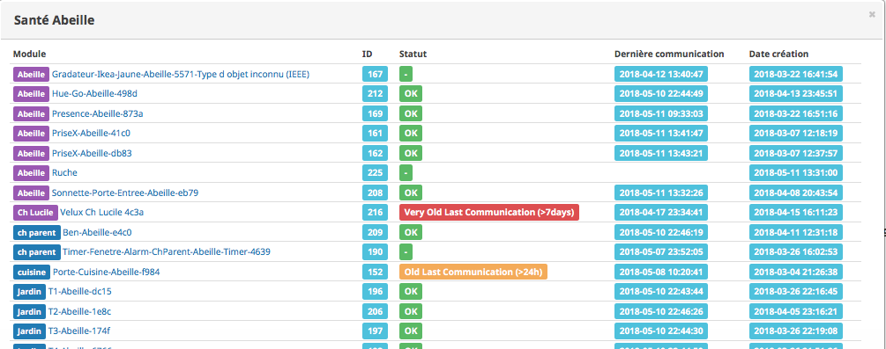
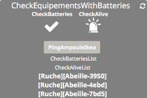
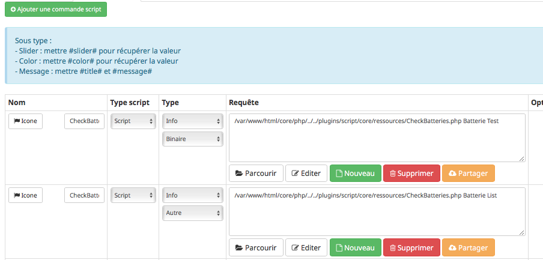

:toc:

= Santé des équipements

Il y a probablement deux informations qu'il est interessant de monitorer pour vérifier que tout fonctionne: 

* le niveau des batteries 
* et le fait que des messages sont echangés.

Je vous propose 2 méthodes.

== Health

=== Communication

Un cron tourne toutes les minutes pour vérifier la date du dernier message recu pour chaque équipement. Pour visialiser le résultat ouvrir Plugins->Protocoles Domotique->Abeille et clic sur l'icone Santé. Vous devriez avoir un résultat comme:

Actuellement il existe 4 statuts:

- Un carré vert avec un "-": Pas de test fait. Par exemple Abeille ne recoit pas de message venant d'une telecommande Ikea.
- Un carré vert avec Ok, soit l'équipement à un timeout de defini et le dernier message est arrivé dans cette période, soit il n'y en a pas et un message à été recu dans le 24 dernieres heures.
- un carré orange, l'equipement n'a pas de time out defini et le dernier message est plus vieux que 24h et moins que 7 jours
- un carré rouge, soit le capteur à un time out et le dernier message est plus vieux que ce time out, soit il n'a pas de time out et le dernier message est plus que 7 jours.

=== Batterie

En utilisant le menu Analyse->Equipements, vous trouverez l'état des batteries. Ici un exemple avec des objets Zwave et Abeille/Zigbee.

image::images/Capture_d_ecran_2018_05_11_a_15_47_55.png[]

== Script / Widget

Vous aurez un widget comme celui ci:

qui vous permettra d'avoir une alarme sur le niveau de batterie et sur la remontée de message ainsi que la liste des équipements en défaut.

Pour se faire un script est en cours de dev et de test dont voici les détails.

Vous pouvez le faire tourner en manuellement en ssh ou l'intégré dans Jeedom à l'aide du plugin script (Solution présentée ci dessous).

image::images/Capture_d_ecran_2018_03_27_a_09_42_11.png[]

Vous créez un équipement avec une Auto-Actualisation à la fréquence que vous souhaitez, ici toutes les heures.

image::images/Capture_d_ecran_2018_03_27_a_09_44_59.png[]

=== Script

Le script dont vous aurez besoin est https://github.com/KiwiHC16/Abeille/blob/master/resources/AbeilleDeamon/CheckBattery.php

Faites un copy/paste dans le plugin script de Jeedom.

=== Parametres internes au script

Lorsque vous allez éditer le script dans les étapes suivantes, vous trouverez les lignes suivanted en début de script:

[source,]
----
    $minBattery = 30; // Taux d'usage de la batterie pour générer une alarme.
    $maxTime    = 24 * 60 * 60; // temps en seconde, temps max depuis la derniere remontée d'info de cet équipement
----

A vous de mettre, les valeurs qui conviennent à votre systeme.

Juste après vous trouverez:

[source,]
----
    // Liste des équipements à ignorer
    $excludeEq = array(
                       	"[Abeille][Ruche]" => 1,
                       	"[Abeille][CheckEquipementsWithBatteries]" => 1,  // L objet du script lui-meme

                       );
----

C'est le tableau qui contient la liste des Equipements qu'il ne faut pas prendre en compte. Par exemple ici l'objet ruche et l'objet script (c'est à dire lui-même).

=== Batterie

Créez deux commandes scripts:

Donnez un nom à la commande, faites Nouveau, donnez le nom du script "CheckBatteries.php", dans l'éditeur faites un paste du code, Enregistrer, ajoutez les parametres à la commande et sauvegardez. 

Le premier parametre est "Batterie" car nous sommes dans le test des batteries. 

Le second paramètre est "Test" pour la première commande pour avoir un retour binaire. 0: pas de Batterie en défaut, 1: au moins une Batterie sous le niveau minimum.

Le second paramètre est "List" pour la seconde commande pour avoir la liste des équipements avec un niveau de Batterie inférieure au  niveau miniCheckBatteries.phpmum.

=== Messages échangés

La même chose que pour Batterie avec pour paramètre Alive.

image::images/Capture_d_ecran_2018_03_27_a_10_15_40.png[]

=== Ping

Certains équipements ne remontent pas forcement des informations de facon régulière, comme une ampoule qu'on allume une fois par semaine. Donc pour forcer l'échange de message et vérifier la présence d'un équipement, il y a une fonction "Ping".

Pour l'instant elle fonctionne pour les ampoules Ikea.

Faites un commande:

image::images/Capture_d_ecran_2018_03_27_a_10_18_37.png[]

En appuyant sur le bouton du widget, les équipements doivent être interrogé et repondre. Ensuite si vous faites un refresh du widget, ils ne doivent plus apparaitre dans la liste Alive s'ils y étaient.

