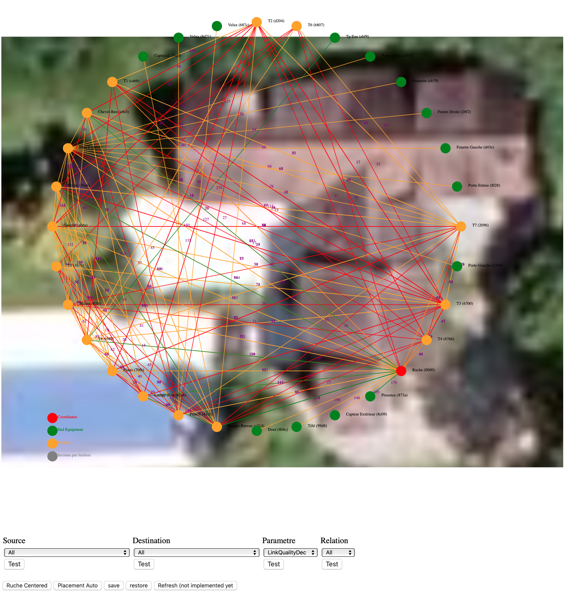
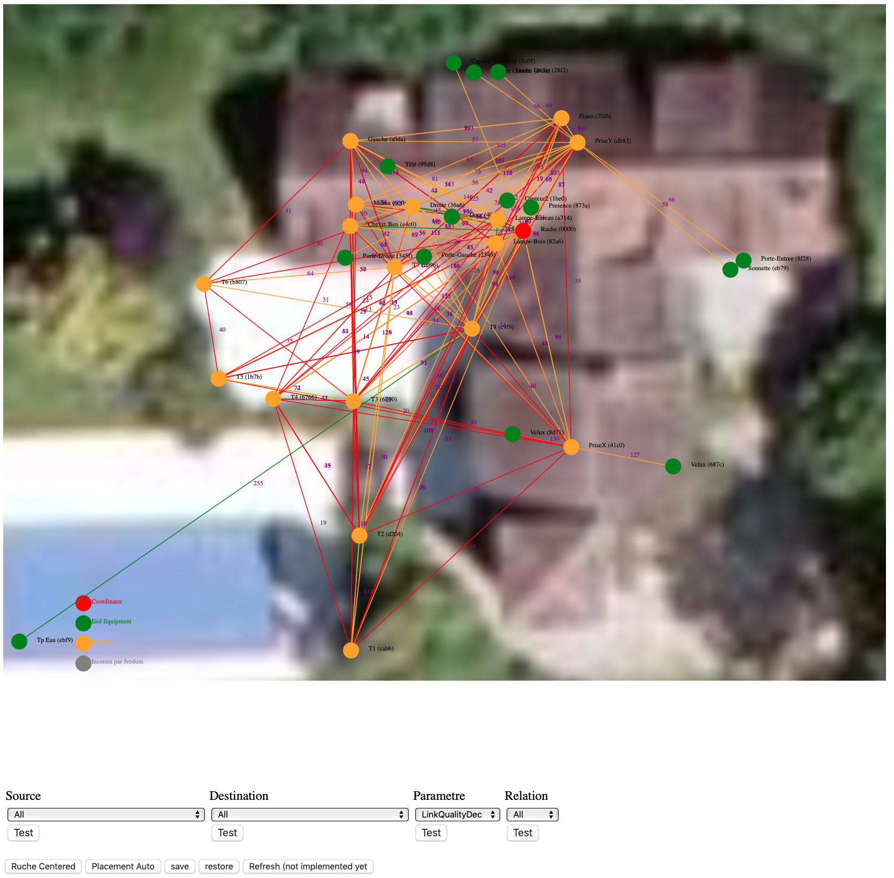
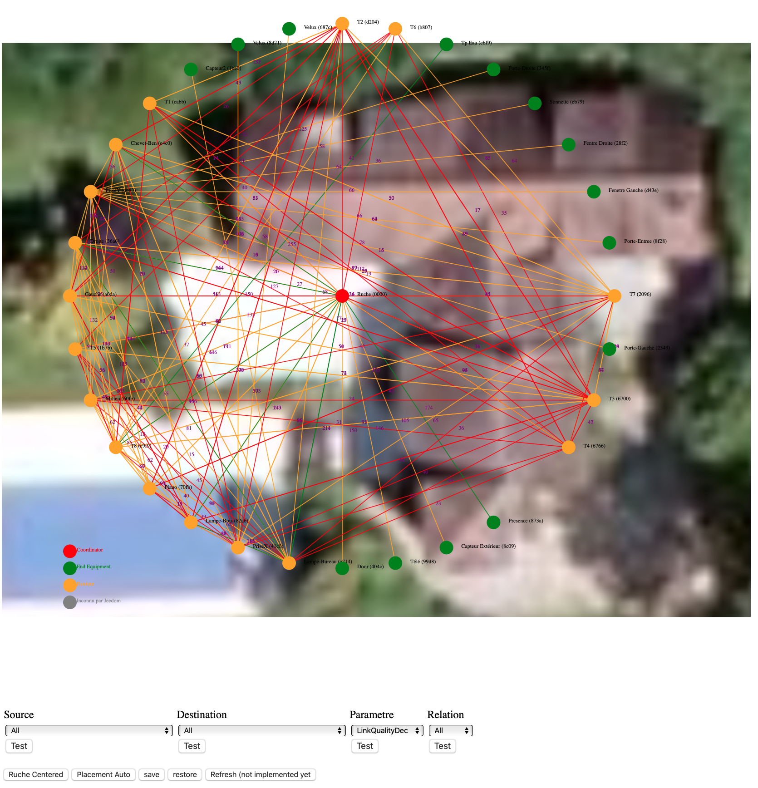

:toc:

= LQI

Afin de comprendre la situation radio de votre réseau, vous pouvez utiliser ce script AbeilleLQI_Map.php et visualiser les résultats dans un browser web:

http://[adresse de votre jeedom]/plugins/Abeille/Network/AbeilleLQI_Map.php

Vous pouvez vérifier que l'execution est en cours en monitorant le log AbeilleParser. Vous devriez voir passer des messages comme celui ci (Type 804E):

[source,]
----
AbeilleParser 2018-04-13 09:43:24[DEBUG]Type: 804E: (Management LQI response)(Decoded but Not Processed); SQN: 11; status: 00; Neighbour Table Entries: 0A; Neighbour Table List Count: 02; Start Index: 00; NWK Address: df33; Extended PAN ID: 28d07615bb019209; IEEE Address: 00158d00019f9199; Depth: 1; Link Quality: 152; Bit map of attributes: 1a
----

Si cela ne fonctionne pas, vous pouvez faire la manip à la main:
[source,]
----
cd /var/www/html/plugins/Abeille/Network
php AbeilleLQI_Map.php
----

[quote,]
____
C'est une version brute de fonderie alors il y a plein de bonnes raisons pour que cela ne fonctionne pas et demande votre expertise.
____

== Tableau

Le script va interroger tous les équipements qu'il détecte, un à un. Le procesus est assez long et pour l'instant la page reste blanche tant que la collect est en cours. Soyez donc patient. Si les résultats sont interessants, je verrai à faire une interface plus conviviale.

Lors de la premiere execution un tableau est généré avec toutes les informations collectées (les exemples ci dessous ne contiennent pas toutes les colonnes car depuis certaines ont été ajoutées.

=== Sur mon systeme de test, après 40s, cela donne:

.LQI Systeme de test
[width="100%",options="header,footer"]
|====================
|NE|Voisine|Relation|Profondeur|LQI
|0000|df33|Child|01|152
|0000|a008|Child|01|141
|0000|7bd5|Child|01|169
|0000|dcd9|Child|01|175
|0000|3950|Child|01|167
|0000|5dea|Child|01|144
|0000|4ebd|Child|01|161
|0000|633e|Child|01|219
|0000|c7c0|Child|01|174
|0000|d45e|Sibling|00|158
|d45e|0000|Sibling|00|186
|d45e|2389|Child|02|255
|====================

La première colonne contient l'adresse de l'équipement qui a été interrogé.
La deuxieme colonne continet l'adresse de l'équipement voisin connu
La troisieme colonne contient le type de relation entre les deux équipements.
La quatrieme colonne contient la profondeur de l'équipement dans l'arborescence du réseau.
La cinquième colonne contient le LQI (Link Quality Indicator), la qualité de la liaison radio.

On peut voir que le coordinateur "0000" a 9 enfants (des capteurs Xiaomi) et un "Sibling" qui est un routeur (Ampoule Ikea dans ce cas).

On peut y voir que le routeur d45e est "Sibling" avec le coordinateur (ZiGate). Qu'il possède un équipement enfant qui est donc en 2ieme niveau.

=== Sur mon système de prod

Celui ci contient au moins 8 routeurs (Ampoules Ikea et Prises Xiaomi).

Petites interrogations/Observation:
- des "Relation" sont "Unknown" : bug ou valeur remontée inconnue, uniquement sur ma HueGo actuellement.
- des "Profondeur" ont des valeurs "0F" qu'il faut que je comprenne.
- Aucun des routeurs ne possède de "Child".

Après 4 minutes, cela donne:

.LQI Systeme de production
[width="100%",options="header,footer"]
|====================
|NE|Voisine|Relation|Profondeur|LQI
|0000|1be0|Child|01|189
|0000|5571|Child|01|212
|0000|b774|Child|01|146
|0000|873a|Child|01|197
|0000|4260|Child|01|48
|0000|d43e|Child|01|151
|0000|6c0B|Child|01|51
|0000|0F7e|Child|01|194
|0000|f984|Child|01|59
|0000|2349|Child|01|81
|0000|345f|Child|01|94
|0000|28f2|Child|01|137
|0000|a728|Sibling|00|81
|0000|41c0|Sibling|00|167
|0000|174f|Sibling|00|51
|0000|46d9|Sibling|00|105
|0000|60fb|Sibling|00|80
|0000|a0da|Sibling|00|85
|0000|498d|Sibling|00|135
|0000|e4c0|Sibling|00|84
|a728|0000|Sibling|00|145
|a728|174f|Sibling|0F|27
|a728|41c0|Sibling|0F|76
|a728|46d9|Sibling|0F|90
|a728|498d|Sibling|0F|47
|a728|60fb|Sibling|0F|87
|a728|a0da|Sibling|0F|86
|a728|db83|Sibling|0F|63
|41c0|0000|Parent|00|171
|41c0|e4c0|Sibling|01|59
|41c0|db83|Sibling|01|169
|41c0|7714|Sibling|01|110
|41c0|498d|Sibling|01|146
|174f|0000|Sibling|00|97
|174f|1b7b|Sibling|0F|34
|174f|46d9|Sibling|0F|29
|174f|498d|Sibling|0F|21
|174f|60fb|Sibling|0F|29
|174f|6766|Sibling|0F|26
|174f|7714|Sibling|0F|45
|174f|8ffe|Sibling|0F|45
|174f|a728|Sibling|0F|29
|174f|db83|Sibling|0F|45
|174f|e4c0|Sibling|0F|20
|46d9|0000|Sibling|00|179
|46d9|174f|Sibling|0F|33
|46d9|41c0|Sibling|0F|61
|46d9|498d|Sibling|0F|119
|46d9|498d|Sibling|0F|119
|46d9|7714|Sibling|0F|83
|46d9|a0da|Sibling|0F|111
|46d9|a728|Sibling|0F|97
|46d9|c551|Sibling|0F|22
|46d9|db83|Sibling|0F|145
|46d9|e4c0|Sibling|0F|68
|60fb|0000|Parent|00|145
|60fb|174f|Sibling|0F|32
|60fb|41c0|Sibling|0F|63
|60fb|46d9|Sibling|0F|129
|60fb|498d|Sibling|0F|91
|60fb|6766|Sibling|0F|16
|60fb|7714|Sibling|0F|31
|60fb|8ffe|Sibling|0F|16
|60fb|a0da|Sibling|0F|85
|60fb|a728|Sibling|0F|93
|60fb|db83|Sibling|0F|112
|60fb|e4c0|Sibling|0F|30
|a0da|0000|Sibling|00|152
|a0da|41c0|Sibling|0F|70
|a0da|46d9|Sibling|0F|106
|a0da|498d|Sibling|0F|41
|a0da|60fb|Sibling|0F|81
|a0da|6766|Sibling|0F|17
|a0da|7714|Sibling|0F|46
|a0da|a728|Sibling|0F|91
|a0da|db83|Sibling|0F|63
|a0da|e4c0|Sibling|0F|50
|498d|db83|Parent|01|247
|498d|0000|Unknown|00|252
|498d|41c0|Unknown|02|252
|498d|7714|Unknown|02|247
|498d|46d9|Unknown|02|247
|498d|a728|Unknown|02|247
|498d|c551|Unknown|02|252
|498d|174f|Unknown|02|252
|498d|a0da|Unknown|02|252
|498d|60fb|Unknown|02|247
|498d|6766|Unknown|02|238
|498d|e4c0|Unknown|02|247
|498d|1b7b|Unknown|02|0
|498d|dc15|Unknown|02|0
|498d|8ffe|Unknown|02|0
|498d|8ffe|Unknown|02|0
|e4c0|0000|Sibling|00|152
|e4c0|41c0|Sibling|0F|106
|e4c0|174f|Sibling|0F|23
|e4c0|46d9|Sibling|0F|69
|e4c0|498d|Sibling|0F|80
|e4c0|60fb|Sibling|0F|31
|e4c0|7714|Sibling|0F|42
|e4c0|a0da|Sibling|0F|51
|e4c0|c551|Sibling|0F|20
|e4c0|db83|Sibling|0F|59
|====================

== Graphique Vieille Version

=== Configuration

Afin de visualiser les données, il vous faut modifier le fichier NetworkDefinition.php dans le repertoire Abeille/Network car celui-ci contient les équipements, leur nom et positions.

la premiere table:

    $knownNE = array(
                     "0000" => "Ruche",         // 00:15:8d:00:01:b2:2e:24
 // Abeille Prod JeedomZwave
                     "dc15" => "T1",
                     "1e8c" => "T2",
                     "174f" => "T3",            // 00:0b:57:ff:fe:49:10:ea
...

définie la liste des équipements en mettant leur adresse ZigBee et leur nom.

Dans la deuxieme table vous definissez les positions des équipements et leur couleur:

    $Abeilles = array(
                      'Ruche'    => array('position' => array( 'x'=>700, 'y'=>520), 'color'=>'red',),
    // Abeille Prod JeedomZwave
	// Terrasse
                      'T1'       => array('position' => array( 'x'=>300, 'y'=>450), 'color'=>'orange',),
                      'T2'       => array('position' => array( 'x'=>400, 'y'=>450), 'color'=>'orange',),
                      'T3'       => array('position' => array( 'x'=>450, 'y'=>350), 'color'=>'orange',),
                      
                      
=== Graphique

Une fois la configuration faite vous devrier avoir le schéma de votre réseau. Par exemple pour moi, j'ai fait une configuration comprenant les équipements de mon réseau de production mais aussi le réseau de test. Capture d'écran des données du réseau de test:

image::images/Capture_d_ecran_2018_04_30_a_23_45_51.png[]

On peut voir toutes les voisines rapportées par les équipements.

Vous pouvez choisir ce qui est affiché à l'écran:

- premier menu permet de selectionner les équipements qui ont remontés des voisines.
- second menu permet de selectionner les équipements qui ont été mentionné comme étant un voisin d'un autre équipement
- le troisieme menu permet en mode cache d'utiliser les fichier json contenant les informations collectées, le mode refresh permet d'interroger le reseau
- le dernier menu permet de selectionner l information affiché sur les fleches

Par exemple, je veux toutes les relations de voisinages alors dans le premier menu je choisi all.

Par exemple, je veux voir tous les équipements rapportant vori un équipement xxxx, je choisi none dans le premier menu et xxxx dans le second.

Dans la capture ci dessus on peut voir que le noeud Detecteur Smoke est un fils de l'ampoule bois bureau, alors que tous les autres équipements rapportent à la zigate en direct. 

== Graphique Nouvelle Version

=== Configuration

Normalement il n'y rien a faire de particulier. Juste un clic sur "Network Graph":

image::images/Capture_d_ecran_2018_10_04_a_02_39_04.png[]

Juste ouvrir le graph et les abeilles seront disposées sur un grand cercle. Vous pourrez déplacer les abeilles en clic dessus, deplacement, relache.

Vous pouvez aussi choisir votre fond d'écran pour positionner vos abeilles.

=== Filtre

Les abeilles sont toujours representées. Vous pouvez appliquer des filtres sur les voisines. 

[quote,Kiwi]
____
Pour qu'une valeur soit prise en compte, clic sur le bouton Test associé en dessous.
____

* Source: La relation de voisinage qui a pour source la valeur selectionnée sera dessinée. All pour toutes et None pour aucune.

* Destination: La relation de voisinage qui a pour destination la valeur selectionnée sera dessinée. All pour toutes et None pour aucune.

* Parametre: permet de selectionner la valeurs associée à la relation qui sera imprimer le long du lien. Si le parametre choisi est le LinkQualityDec alors le code couleur est vert LQI bon, orange LQI moyen , rouge LQI pas bon.

* Relation: permet de choisir les relations hirarchique que l'on veut afficher.

* Save: permet de sauvegarder en local sur le PC CLient un graph.

* Restore: permet de recupérer un graph sauvegardé

Exemple avec tout positionné à la main:

Exemple qu'avec les relations Child:

image::images/Capture_d_ecran_2018_10_04_a_02_23_17.png[]

Vue interressante car elle permet de voir quels sont le équipements terminaux rattachés à quels routeurs.

Exemple en demandant la Ruche au centre:

Exemple avec l'upload d'une image en fond d'écran:

image::images/Capture_d_ecran_2018_10_04_a_11_15_34.png[]
