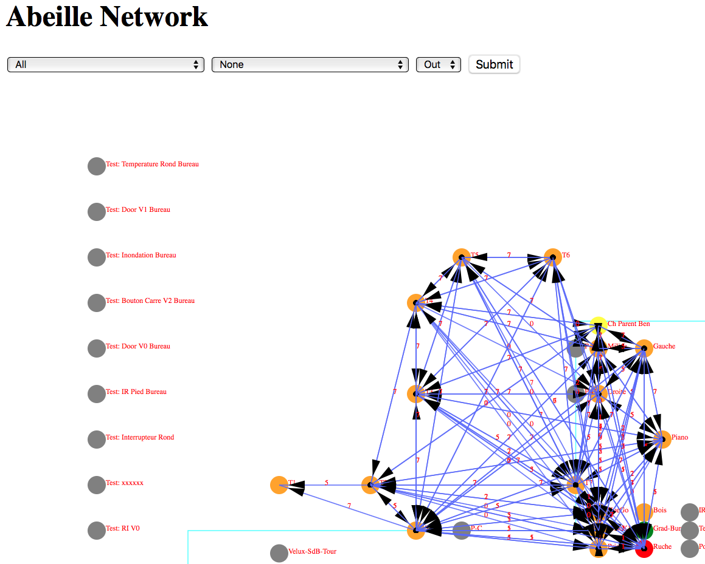

:toc:

= Link Status

Afin de comprendre la situation radio de votre réseau, vous pouvez utiliser ce script RadioVoisinesMap.php et visualiser les résultats dans un browser web:

http://[jeedom]/plugins/Abeille/Network/RadioVoisinesMap.php

Ce script va présenter graphiquement les informations échangées entre les routeurs dans les messages "Link Status".

Faites une capture du traffique avec wireshark, puis faites une sauvegarde JSON sous essai.json:

image::images/Capture_d_ecran_2018_05_10_a_23_33_32.png[]

image::images/Capture_d_ecran_2018_05_10_a_23_33_48.png[]

Une fois cela fait ouvrez la page: http://[jeedom]/plugins/Abeille/Network/RadioVoisinesMap.php

Vous devriez avoir un résultat comme:

Dans le menu déroulent le premier champ permet de filtrer les enregistrement qui ont pour adresse de source la valeur selectionnée. Idem pour le deuxième champ mais pour l'adresse destination. Et enfin le dernier champ permet d'afficher la valeur du champ In ou du champ Out. La valeur In ou Out est la dernière valeur trouvée dans le fichier json lors de son analyse. 

Evidement la configuration est celle de mon réseau de prod et de mon réseau de test donc il vous faut déclarer votre propre réseau dans le fichier NetworkDefinition.php.

Dans le tableau knowNE mettre l'adresse courte suiivie du nom de léquipement:

[source,]
----
    $knownNE = array(
                     "0000" => "Ruche",         // 00:15:8d:00:01:b2:2e:24 00158d0001b22e24 -> Production
                                                // 00:01:58:d0:00:19:1b:22 000158d000191b22 -> Test
 // Abeille Prod JeedomZwave
                     "dc15" => "T1",            // 00:0B:57:ff:fe:49:0D:bf 000B57fffe490Dbf
                     "1e8c" => "T2",
                     "174f" => "T3",            // 00:0b:57:ff:fe:49:10:ea
                     "6766" => "T4",

----

Puis dans le tableau Abeilles, définissez les coordonnées de chaque équipements:

[source,]
----
    $Abeilles = array(
                      'Ruche'    => array('position' => array( 'x'=>700, 'y'=>520), 'color'=>'red',),
    // Abeille Prod JeedomZwave
	// Terrasse
                      'T1'       => array('position' => array( 'x'=>300, 'y'=>450), 'color'=>'orange',),
                      'T2'       => array('position' => array( 'x'=>400, 'y'=>450), 'color'=>'orange',),
                      'T3'       => array('position' => array( 'x'=>450, 'y'=>350), 'color'=>'orange',),
                      'T4'       => array('position' => array( 'x'=>450, 'y'=>250), 'color'=>'orange',),
----

