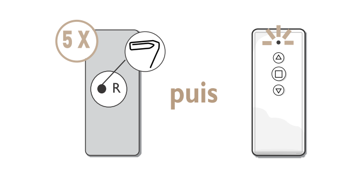
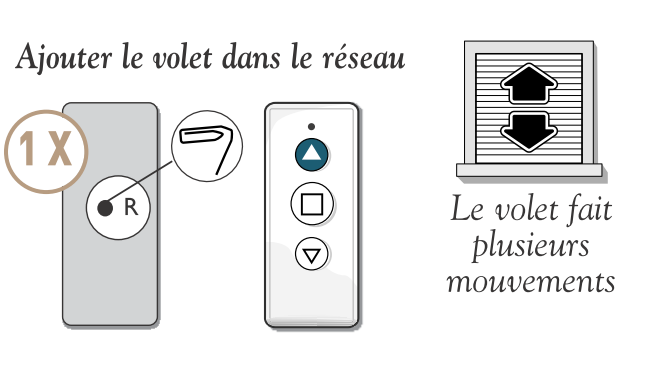
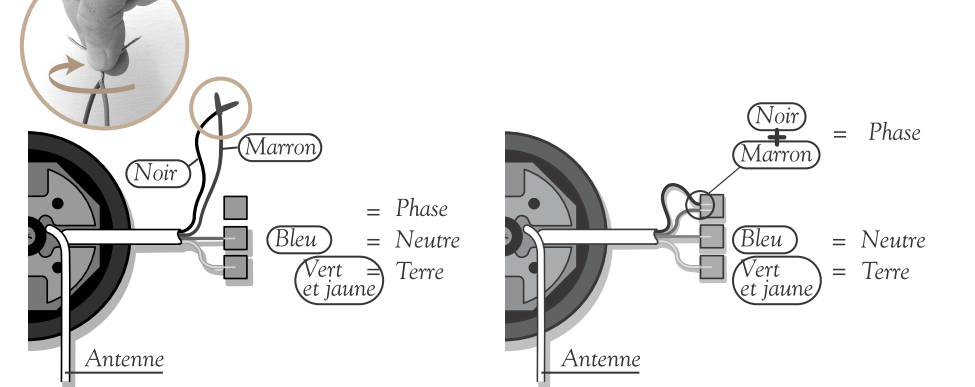
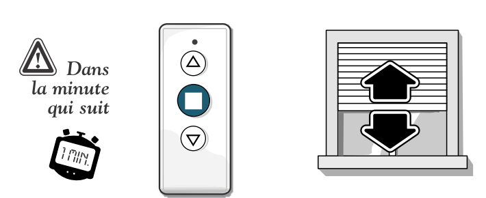

= Profalux

== Inclusion d'un voletfootnote:[Source:Zigate.fr.]

Comme pour tous modules ZigBee et pour bien comprendre la procédure, il faut savoir que :

La ZiGate est un coordinateur ZigBee qui permet de contrôler / créer un réseau. De la même manière que le couple télécommande / ampoule ZigBee, il est important que les deux matériels appartiennent et soient authentifiés sur le même réseau.

N’ayant pas de boutons ou d’interfaces, un volet Profalux Zoé ne peux pas rentrer tout seul sur un réseau ZigBee. Il est indispensable d’avoir une télécommande maître qui jouera le rôle d’interface entre le volet et la ZiGate.

- Étape 1:

La première chose à faire est de remettre à zéro la télécommande maître. Pour cela, il faut:

* Retourner l’appareil
* A l’aide d’un trombone, appuyer 5 fois sur le bouton R

La télécommande va clignoter rouge puis vert

- Étape 2 : Appairage du volet à la télécommande

Suite à l’étape 1, le volet va faire un va et vient (attendre un petit moment).

Dans la minute suivante, appuyer sur la touche STOP

Le volet va faire un va et vient (signe que la commande a bien été reçue). Pour tester le bon fonctionnement, vous devriez pouvoir piloter le volet avec la télécommande.

- Étape 3 : Mettre la ruche en mode inclusion

Pour cela appuyer sur le bouton inclusion de votre ruche depuis le dashboard.

- Étape 4 : Appairer le volet à la ZiGate

Une fois le réseau de la ZiGate ouvert, il ne vous reste plus qu’à:

* Retourner votre télécommande
* Appuyer 1 fois sur R
* Appuyer ensuite sur la flèche du haut
* Le moteur devrait faire un va et vient … c’est gagné !

* Pour finir, appuyer sur la touche STOP de la télécommande.

Faites un rafraichissement de votre dashboard et votre volet devrait apparaitre.

== Résolution de problèmes:

- Le volet ne répond plus à la télécommande.

Si par une mauvaise manipulation votre volet ne répond plus à la télécommande, il est nécessaire de faire un reset de la télécommande et du volet.

* Retourner l’appareil
* A l’aide d’un trombone, appuyer 5 fois sur le bouton R

* Couper l'alimentation électrique
* Réunir les fils noir et marron puis les brancher sur la borne de phase

* Remettre l'alimentation électrique pendant 5 secondes. Le volet devrait faire un petit mouvement.
* Couper l'alimentation électrique
* Séparer les fils noir et marron. Brancher le fils marron sur la phase. Si votre fils noir était brancher avec le bleu aupparavant, rebrancher le avec le bleu sinon laisser le fils noir seul en pensant à l'isoler(capuchon noir)

image::images/profalux_inclusion_reset_volet3.png[]

* Remmettre l'alimentation électrique et dans la minute appuyer sur le bouton stop

Le volet devrait faire des mouvement de va-et-vient puis s'arrêter
* La télécommande devrait à nouveau fonctionner
* Recommencer à nouveau la procédure d'inclusion

== Retour expérience

[quote,MaxDak]
____
Confronté au même problème à savoir: va et viens en guise de réponse à toutes les commandes (mes volets profalux sont récents moins d'un mois).
J'ai enfin réussi à les piloter !
J'ai suivi la procédure classique d'appairage à la seule différence que j'ai fermé totalement le volet avant de commencer la procédure.
Et la miracle toutes les commandes fonctionnent...
____

