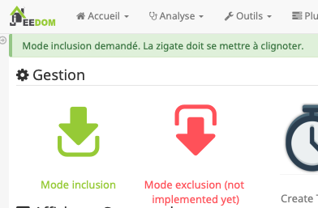
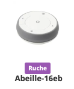
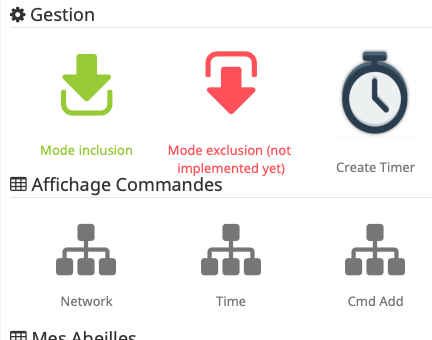

:toc:

= Tuto: Presence -> Ampoule

== Presence->Ampoule

Pilotage d une ampoule à partir d'un capteur de présence.

=== Inclusion Capteur presence

Aller à la page de configuration du plugin Abeille et clic sur fleche verte pour l inclusion:

Prendre le capteur de presence Xiaomi et faire un appui long (>6s) sur le bouton lateral. Le capteur doit se mettre à flasher et un message d'information doit apparaitre dans jeedom:

image::images/Capture_d_ecran_2018_10_30_a_10_16_27.png[]

Rafraichissez la page pour voir votre capteur:

image::images/Capture_d_ecran_2018_10_30_a_10_18_23.png[]

Vous pouvez changer son nom, je vais lui donner comme nom "Presence" pour la suite.

=== Inclusion Ampoule Ikea

Mettre sous tension votre ampoule. Elle doit être allumée pour commencer la manipulation.

Aller à la page de configuration du plugin Abeille et clic sur fleche verte pour l inclusion:

Prendre le capteur de presence Xiomi et faire un appui long (>6s) sur le bouton lateral. Le capteur doit se mettre à flasher et un message d'information doit apparaitre dans jeedom:

En partant de l'ampoule allumée, l'éteindre et la rallumer 6 fois de suite. A la fin de cette opération l'ampoule doit être allumée. Puis elle doit se mettre à clignoter et un message d'information doit apparaitre dans jeedom:

image::images/Capture_d_ecran_2018_10_30_a_10_27_35.png[]

Rafraichissez la page pour avoir votre ampoule:

image::images/Capture_d_ecran_2018_10_30_a_10_29_10.png[]

Vous pouvez changer son nom, je vais lui donner comme nom "Ampoule" pour la suite.

=== Pilotage de l ampoule

Nous allons utiliser les scénarios:

image::images/Capture_d_ecran_2018_10_30_a_10_33_20.png[]

Créons un scénario "test" avec pour déclencheur "Presence".

image::images/Capture_d_ecran_2018_10_30_a_10_38_29.png[]

Et les actions:

image::images/Capture_d_ecran_2018_10_30_a_10_40_48.png[]

Ici, quand une présence est détectée, on allume l ampoule et quand la présence n'est pas présente on eteint l ampoule.

== Presence->Ampoule<-Telecommande

Dans la configuration précedente, nous allons ajouter une télécommande pour controler l'ampoule.

=== Inclusion télécommande

Aller à la page de configuration du plugin Abeille et clic sur fleche verte pour l inclusion:

Prendre la telecommande Ikea et faire 4 appuis sur le bouton OO au dos de la télécommande. La télécommande doit se mettre à flasher rouge en face avant et un message d'information doit apparaitre dans jeedom:

image::images/Capture_d_ecran_2018_10_30_a_10_58_53.png[]

Rafraichissez la page pour voir votre capteur:

Je vais lui donner le nom "Tele" par la suite. A cette étape cet objet Tele dans Jeedom ne peut ête utilisé. Il faut executer les étapes de du chapitre "Simuler la télécommande".

Continuons en configurant l ampoule depuis la Tele:

* Allumer l'ampoule.
* Approcher la télécommande à quelques centimetres de l ampoule
* Appuyer plus de 10s sur le bouton OO au dos de la télécommande: la led rouge sur la face avant de la télécommande doit clignoter et l ampoule doit se mettre à à clignoter.

Ca y est la télécommande pilote l'ampoule et l'ampoule remonte son état à Jeedom.

=== Simuler la télécommande

Cette opération est un peu délicate mais doit permettre de récupérer l'adresse de groupe utilisée par la télécommande suite aux opérations ci dessus. Dans le futur j'espere rendre cela automatique.

Aller dans la page de configuration du plugin et clic sur "Network" icon pour faire apparaitre les parametres dans l'Ampoule:

Sur l objet Ampoule vous devez vous le champ "Groups" apparaitre sans information:

image::images/Capture_d_ecran_2018_10_30_a_11_36_43.png[]

Recuperons l'adresse de l ampoule, en ouvrant la page de configuration de l ampoule:

image::images/Capture_d_ecran_2018_10_30_a_11_42_09.png[]

Le champ "Topic Abeille" coontient l adresse, ici "9252".

Interrogeons maintenant l'ampoule, avec un getGroupMemberShip depuis l objet Ruche:

image::images/Capture_d_ecran_2018_10_30_a_11_45_23.png[]

indiquez l'adresse de l ampoule.

Maintenant le champ "Groups" de l ampoule doit contenir l'adresse de groupe:

image::images/Capture_d_ecran_2018_10_30_a_11_47_24.png[]

ici le groupe utilisé par la télécommande est "f65d".

Maintenant nous pouvons mettre à jour la télécommande dans jeedom. Ouvrez les commandes de la Telecommande:

image::images/Capture_d_ecran_2018_10_30_a_11_50_17.png[]

Dans le champ "Topic" des commandes vous pouvez voir le texte \#addrGroup# qu'il faut remplacer par la valeur du groupe, ici "f65d" et sauvegarder.

Cela donne:

image::images/Capture_d_ecran_2018_10_30_a_11_54_51.png[]

Mainteant vous pouvez commander votre ampoule depuis la Télécommande physique et depuis la Télécommande Jeedom.

image::images/Capture_d_ecran_2018_10_30_a_11_58_42.png[]

PS: Les scénarios ne sont pas implémentés pour l'instant (30/10/2018):

* Sc1, Sc2, SC3 sur la télécommande dans Jeedom, 
* et les boutons "Fleche Gauche", "Fleche Droite" de la télécommande physique.

