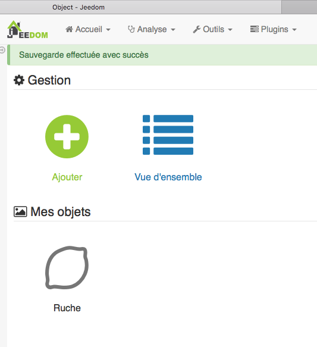
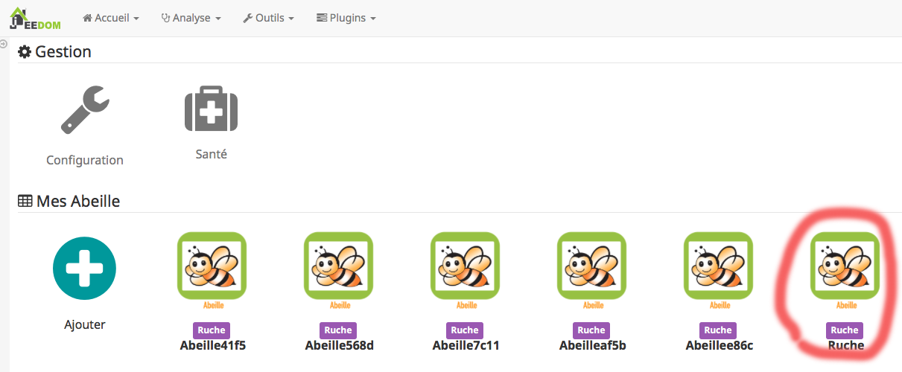
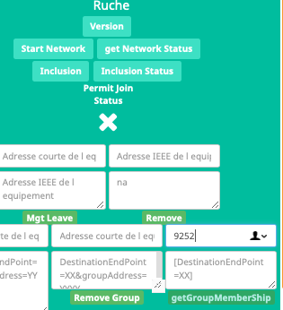

# Présentation 

(Portage en cours de la documentation vers le format officiel jeedom, le texte que vous lisez est en cours d'écriture. La doc originale est toujours à [cet emplacement](https://github.com/KiwiHC16/Abeille)


## Abeille


*Le plugin Abeille*  permet de mettre en place un réseau ZigBee avec des produits du marché et des réalisations personnelles (DIY) par l'intermédaire de la passerelle Zigate.

"ZiGate est une passerelle universelle compatible avec énormément de matériels radios ZigBee. Grâce à elle, vous offrez à votre domotique un large panel de possibilités. La ZiGate est modulable , performante et ouverte pour qu'elle puisse évoluer selon vos besoins.
"
Dixit son créateur.

Ce plugin est né de besoins personnels : capteur de température radio distant avec un réseau sécurisé, mesh,… 

Finalement, il intègre de plus en plus d’équipements :
[Compatibilité](https://github.com/KiwiHC16/Abeille/blob/master/Documentation/040_Compatibilite.adoc)

Mon réseau personnel fonctionne depuis plusieurs mois et possède actuellement 45 équipements et continue de grossir.

Ce plugin inclus les fonctions de base pour la gestions de équipements comme On/Off/Toggle/Up/Down/Detection/… mais aussi des fonctions avancées pour faciliter la gestion d’un gros réseau :
* Retour d'état des équipements,    
* Santé (Dernière communication,…)
* Niveau des batteries 
* Graphe du réseau
* Liste de tous les équipements du réseau
* Informations radio sur les liaisons entre les équipements
* En mode USB ou en mode Wifi
* Fonctionne avec Homebridge
-    …


## Timer


J’ai aussi intégré un « sous-plugin » [TIMER](#tocAnchor-1-6) qui fonctionne à la seconde dans ce plugin. Il faudra peut être que je fasse un plugin dédié et indépendant.


## Enjoy

Pour ceux qui utiliseront ce plugin, je vous souhaite une bonne expérience. Pour ceux qui auraient des soucis, vous pouvez aller sur le forum ou ouvrir une « issue » dans github (Je ferai de mon mieux pour vous aider).


# Raccourcis

[Premiers pas](https://github.com/KiwiHC16/Abeille/blob/master/Documentation/010_Introduction.adoc)

[Pour Tous](https://github.com/KiwiHC16/Abeille/blob/master/Documentation/)

[Equipements supportés](https://github.com/KiwiHC16/Abeille/blob/master/Documentation/040_Compatibilite.adoc)

[Pour les développeurs](https://github.com/KiwiHC16/Abeille/blob/master/Documentation/012_Dev.adoc)

[Systèmes Testés](https://github.com/KiwiHC16/Abeille/blob/master/Documentation/015_Systemes_Testes.adoc)

[Change Log](https://github.com/KiwiHC16/Abeille/blob/master/Documentation/075_version.adoc)

[links](900_Timers.md)


# Plus de détails

Ce plugin Jeedom permet de connecter un réseau ZigBee au travers de la passerelle ZiGate. 
Il est en permanente évolution.

## Il permet

- de connecter les ampoules IKEA
- de connecté toute la famille Xiaomi Zigbee (Sensor presence, prise, temperature, humidité, pression, interrupteur, porte).
- de faire les inclusions des equipments zigbee depuis jeedom
- d'avoir l'état de l ampoule IKEA, son niveau de brillance, ses caractéristiques (nom, fabriquant, SW level).
- de commander les ampoules une par une (On/Off, niveau, couleur,...)
- de commander les ampoules et autre par groupe (On/Off, niveau)
- d'avoir l'état de la prise Xiaomi avec la puissance et la consommation (Nom et Fabriquant)
- d'avoir les temperatures, humidité, pression Xiaomi, son nom, tension batterie
- d'avoir la remontée d'une presence (capteur infrarouge xiaomi)
- d'avoir la remontée d'ouverture de porte
- d'avoir les clics sur les interrupteurs (1, 2, 3 ou 4 clics)
- de définir des groupes comprenant des ampoules IKEA et prise xiaomi (Je peux donc avoir un mix dans le même groupe qui est commandé par une télécommande IKEA par exemple, ou faire un va et vient sur des ampoules IKEA avec 2 télécommandes IKEA (ce qui n'est pas possible avec la solution pure IKEA),...)

## Ce qu'on peut faire

Exemples:
- Si j’appuie sur l’interrupteur Xiaomi, avec un scenario Jeedom, j'allume l’ampoule IKEA.
- Avec une télecommande Ikea je commande ampoule Ikea, Hue, OSRAM,... prise ... tout en même temps
- Avec deux, trois, quatre,... télécommandes Ikea je fais un va et vient
- Je contrôle chaque équipement depuis Jeedom.

Et surtout, je profite du « mesh » ZigBee (des ampoules IKEA et prise Xiaomi) car je vous confirme que les prises Xiaomi et les ampoules IKEA font le routage des messages ZigBee.


# Installation

## ZiGate

- La ZiGate est avec le bon firmware et connectée au port USB ou sur son module wifi (le firmware actuellement testé est la version 30e: https://github.com/fairecasoimeme/ZiGate/tree/master/Module%20Radio/Firmware )

## Widget

> Je vous propose d' installer des widgets avant d'installer Abeille pour avoir une interface graphique plus sympa mais ce n'ai pas obligatoire.

- Installer quelques widgets (plugin officiel) qui seront utilisés lors de la création des objets. Ce n'est pas obligatoire mais le résultat est plus joli.
* baromètre pour le capteur Xiaomi Carré (dashboard.info.numeric.barometre )
* thermomètre pour les capteurs Xiaomi ronds et carrés (dashboard.info.numeric.tempIMG)
* humidité pour les capteurs Xiaomi ronds et carrés (dashboard.info.numeric.hydro3IMG)


## Objet de référence

> Afin de trouver rapidement les nouveaux équipements, il est nécessaire de créer une pièce (un objet jeedom) auquel seront rattachés par défaut.

- Créez un objet sur lequel les nouveaux objets seront rattachés automatiquement. Menu Outils->Objet->"+ vert" (Objet Id=1, pour l'instant codé en dur).




Récupérez sont ID en sélectionnant "Vue d'ensemble"


##  Installation du plugin

### Depuis Github

- Créer un répertoire Abeille dans le repertoire des plugins et installer les fichiers.
* ssh sur votre jeedom
* cd /var/www/html/plugins/

- si vous prenez le zip file
```
* mkdir Abeille
* cd Abeille
* unzip le fichier téléchargé de GitHub dans le répertoire
* cd ..
````

- Si vous allez directement avec git
```
* git clone https://github.com/KiwiHC16/Abeille.git Abeille
```

Et pour le développeurs, voici une info très utile:

>Merci @lukebr 

Pour une mise à jour à partir de github :
```
cd ../../var/www/html/plugins/Abeille
sudo git pull https://github.com/KiwiHC16/Abeille
```

Et si il y a eu des bidouilles en local pour écraser avec dernière mise à jour :
```
cd /var/www/html/plugins/Abeille
sudo git reset --hard HEAD
sudo git pull https://github.com/KiwiHC16/Abeille
```

- Et pour finir
```
* chmod -R 777 /var/www/html/plugins/Abeille
* chown -R www-data:www-data /var/www/html/plugins/Abeille
```


Si vous voulez aller a un commit specifique:
```
git reset --hard dd7fa0a
```

### Depuis le market

* Rien de spécifique. Suivre la procédure classique. Pour l'instant il ne doit y avoir qu'une version en beta.

### Alternative : Installation du github depuis le market

- Aller sur configuration puis l'onglet mise à jour, selectionner en dessous l'onglet Github cocher activer . On enregistre.
- Aller sur l'onglet plugin clic et gestion des plugin. Une fenetre s'ouvre que vous connaissez mais sur la gauche il y a une petite fleche pointant vers la droite (clic dessus)
- Faire ajouter à partir d'une autre source et sélectionner GITHUB
- Rentrer la paramètres suivants dans l'ordre :
* ID logique du plugin: Abeille
* Utilisateur ou organisateur: KiwiHC16
* Nom du dépôt: Abeille
* Branche: master

## Activation

- Activation du plugin
* Allez sur l'interface http Jeedom
* Menu Plugin, Gestion des plugin
* sélectionner Abeille


* Activer


* Choisir le niveau de log et Sauvegarder
* Lancer l'installation des dépendances, bouton Relancer et patienter (vous pouvez suivre l'avancement dans le fichier log: Abeille_dep)


* Quand le statut Dépendance passe à Ok en vert (Patientez 2 ou 3 minutes), définir l objet ID et le port serie puis Démarrer les Démons.

Puis:
> Si vous avez un zigate USB, choisissez le bon port /dev/ttyUSBx.
> Si vous avez une zigate Wifi, choisissez le port "WIFI" dans la liste et indiquer son adresse IP.


* Si vous rafraîchissez la page vous devez voir les fichiers de logs.


A noter: Toute sauvegarde de la configuration provoque une relance du cron du plugin et donc un rechargement de la configuration

- Creation des objets
* Allez dans la page de gestion des objets en sélectionnant le menu plugins, puis protocole domotique, puis Abeille
* Vous devriez voir un premier objet "Ruche" (et éventuellement les objets abeille).



* Si vous allez sur le dashboard


* Tous les autres objets seront créés automatiquement dès détection.

## Utilisation de Jeedom
* Allez sur la page principale et vous devriez voir tous les objets détectés. A cette étape probablement uniquement l'objet Ruche si vous démarrez votre réseau ZigBee de zéro.
* Le nom de l objet est "Abeille-" suivi de son adresse courte zigbee.

*A noter: rafraichir la page si vous voyez pas de changement après une action, par exemple après l'ajout d'un équipement.*


# Tuto

## Presence->Ampoule

Pilotage d une ampoule à partir d'un capteur de présence.

### Inclusion Capteur presence

Aller à la page de configuration du plugin Abeille et clic sur fleche verte pour l inclusion:


Prendre le capteur de presence Xiaomi et faire un appui long (>6s) sur le bouton lateral. Le capteur doit se mettre à flasher et un message d'information doit apparaitre dans jeedom:


Rafraichissez la page pour voir votre capteur:


Vous pouvez changer son nom, je vais lui donner comme nom "Presence" pour la suite.

### Inclusion Ampoule Ikea

Mettre sous tension votre ampoule. Elle doit être allumée pour commencer la manipulation.

Aller à la page de configuration du plugin Abeille et clic sur fleche verte pour l inclusion:


Prendre le capteur de presence Xiomi et faire un appui long (>6s) sur le bouton lateral. Le capteur doit se mettre à flasher et un message d'information doit apparaitre dans jeedom:

En partant de l'ampoule allumée, l'éteindre et la rallumer 6 fois de suite. A la fin de cette opération l'ampoule doit être allumée. Puis elle doit se mettre à clignoter et un message d'information doit apparaitre dans jeedom:


Rafraichissez la page pour avoir votre ampoule:


Vous pouvez changer son nom, je vais lui donner comme nom "Ampoule" pour la suite.

### Pilotage de l ampoule

Nous allons utiliser les scénarios:


Créons un scénario "test" avec pour déclencheur "Presence".

image::images/Capture_d_ecran_2018_10_30_a_10_38_29.png)

Et les actions:


Ici, quand une présence est détectée, on allume l ampoule et quand la présence n'est pas présente on eteint l ampoule.


## Presence->Ampoule<-Telecommande

Dans la configuration précedente, nous allons ajouter une télécommande pour controler l'ampoule.

### Inclusion télécommande

Aller à la page de configuration du plugin Abeille et clic sur fleche verte pour l inclusion:


Prendre la telecommande Ikea et faire 4 appuis sur le bouton OO au dos de la télécommande. La télécommande doit se mettre à flasher rouge en face avant et un message d'information doit apparaitre dans jeedom:


Rafraichissez la page pour voir votre capteur:


Je vais lui donner le nom "Tele" par la suite. A cette étape cet objet Tele dans Jeedom ne peut ête utilisé. Il faut executer les étapes de du chapitre "Simuler la télécommande".

Continuons en configurant l ampoule depuis la Tele:

* Allumer l'ampoule.
* Approcher la télécommande à quelques centimetres de l ampoule
* Appuyer plus de 10s sur le bouton OO au dos de la télécommande: la led rouge sur la face avant de la télécommande doit clignoter et l ampoule doit se mettre à à clignoter.

Ca y est la télécommande pilote l'ampoule et l'ampoule remonte son état à Jeedom.

### Simuler la télécommande

Cette opération est un peu délicate mais doit permettre de récupérer l'adresse de groupe utilisée par la télécommande suite aux opérations ci dessus. Dans le futur j'espere rendre cela automatique.

Aller dans la page de configuration du plugin et clic sur "Network" icon pour faire apparaitre les parametres dans l'Ampoule:


Sur l objet Ampoule vous devez vous le champ "Groups" apparaitre sans information:


Recuperons l'adresse de l ampoule, en ouvrant la page de configuration de l ampoule:


Le champ "Topic Abeille" coontient l adresse, ici "9252".

Interrogeons maintenant l'ampoule, avec un getGroupMemberShip depuis l objet Ruche:



indiquez l'adresse de l ampoule.

Maintenant le champ "Groups" de l ampoule doit contenir l'adresse de groupe:


ici le groupe utilisé par la télécommande est "f65d".

Maintenant nous pouvons mettre à jour la télécommande dans jeedom. Ouvrez les commandes de la Telecommande:


Dans le champ "Topic" des commandes vous pouvez voir le texte \#addrGroup# qu'il faut remplacer par la valeur du groupe, ici "f65d" et sauvegarder.

Cela donne:


Mainteant vous pouvez commander votre ampoule depuis la Télécommande physique et depuis la Télécommande Jeedom.


PS: Les scénarios ne sont pas implémentés pour l'instant (30/10/2018):

* Sc1, Sc2, SC3 sur la télécommande dans Jeedom, 
* et les boutons "Fleche Gauche", "Fleche Droite" de la télécommande physique.


# Ikea

## Ampoule

#### Bouton Identify

Ce bouton est créé au moment de la création de l'objet. Celui ci permet de demander à l'ampoule de se manifester. Elle se met à changer d'intensité ce qui nous permet de la repérer dans une groupe d'ampoules par exemple.

#### Creation objet

- Si l'ampoule n'est pas associée à la zigate, avec Abeille en mode Automatique, une association doit provoquer la création de l'obet dans Abeille

- Si l'ampoule est déjà associée à la zigate, avec Abeille en mode Automatique, 
* l'allumage électrique doit provoquer l'envoie par l'ampoule de sa présence (annonce) et la création par Abeille de l'objet associé.
* l'extinction électrique pendant 15s puis allumage électrique doit provoquer l'envoie par l'ampoule de sa présence (son nom) et la création par Abeille de l'objet associé. 
* Vous pouvez aussi Utiliser la commande getName dans la ruche, mettre l’adresse courte dans le titre et rien dans le message. Puis rafraichir le dashboard et la l’ampoule doit être présente.

#### Retour d'état

Pour que l'ampoule puisse remonter automatiquement son état à Jeedom, il faut mettre en place un "bind" et un "set report".

Maintenant c'est automatique mais si cela ne fonctionnait pas il y a toujours la vieille methode.

Pour se faire, il faut utiliser les commandes bind et setReport sur l'objet Ampoule.

Le widget ampoule doit être plus ou moins comme cela:


Il faut faire apparaite les commandes de configuration. Aller dans la page de configuration du plugin et selectionner "Network" dans le chapitre "Affichage Commandes". Maintenant le widget doit ressembler à:


il suffit de faire un BindShortToZigateEtat, setReportEtat. Si votre ampoule supporte la variation d'intensité, faites un BindShortToZigateLevel, setReportLevel.

ur que cela fonctionne il est important que le champ IEEE soit rempli. Si tel n'est pas le cas faites un Liste Equipement sur la ruche et si cela ne suffit pas faire un "Recalcul du Cache" dans Network List de la page de conf du plug in.

> Y a encore du travail en cours pour simplifier cette partie.


#### Bind specifique:

Identifiez l'ampoule que vous voulez parametrer:


Récuperer son adresse IEEE, son adress courte (ici 6766).

De même, dans l'objet Ruche récupérez l'adresse IEEE (Si l'info n'est pas dispo, un reset de la zigate depuis l objet ruche doit faire remonter l'information).

Mettre dans le champ:

- Titre, l'adresse IEEE de l'ampoule que vous voulez parametrer
- Message, le cluster qui doit être rapporté, et l adresse IEEE de la zigate.


Attention a capture d'écran n'est pas à jour pour le deuxieme champs.

Dans message mettre:
```
targetExtendedAddress=XXXXXXXXXXXXXXXX&targetEndpoint=YY&ClusterId=ZZZZ&reportToAddress=AAAAAAAAAAAAAAAA
````

Exemple avec tous les parametres:
````
targetExtendedAddress=90fd9ffffe69131d&targetEndpoint=01&ClusterId=0006&reportToAddress=00158d00019a1b22
````


Après clic sur Bind, vous devriez voir passer dans le log AbeilleParse (en mode debug) un message comme: 


qui confirme la prise en compte par l'ampoule. Status 00 si Ok.


#### Rapport Manuel:

Ensuite parametrer l'envoie de rapport:

- Titre, l adresse courte de l'ampoule
- Message, le cluster et le parametre dans le cluster


Attention a capture d'écran n'est pas à jour pour le deuxieme champs.

````
targetEndpoint=01&ClusterId=0006&AttributeType=10&AttributeId=0000 pour retour d'état ampoule Ikea

targetEndpoint=01&ClusterId=0008&AttributeType=20&AttributeId=0000 pour retour de niveau ampoule Ikea
````


De même vous devriez voir passer dans le log AbeilleParse (en mode debug) un message comme: 


qui confirme la prise en compte par l'ampoule. Status 00 si Ok.

Après sur un changement d'état l'ampoule doit remonter l'info vers Abeille, avec des messages comme:


pour un retour Off de l'ampoule.

=== Gestion des groupes

Vous pouvez adresser un groupes d'ampoules (ou d'équipements) pour qu'ils agissent en même temps.

Pour se faire sur l'objet ruche vous avez 3 commandes:


* Add Group: permet d'ajouter un groupe à l'ampoule. Celle ci peut avoir plusieurs groupes et réagira si elle recoit un message sur l'un de ces groupes.


Le DestinatioEndPoint pour une ampoule Ikea est 01. Pour le groupe vous pouvez choisir. Il faut 4 caractères hexa (0-9 et a-f).

* Remove Group: permet d'enlever l'ampoule d'un groupe pour qu'elle ne réagisse plus à ces commandes.


*getGroupMembership: permet d'avoir la liste des groupes pour lesquels l'ampoule réagira. Cette liste s'affiche au niveau de l'ampoule, exemple avec cette ampoule qui va repondre au groupe aaaa et au groupe bbbb.


#### Telecommnande Ronde 5 boutons

#### Télécommande réelle

(Pour l'instant c'est aux équipements qui recevoient les demandes de la telecommande reelle de renvoyer leur etat vers jeedom, sur un appui bouton telecommande, la ZiGate ne transmet rien au plugin Abeille).

Pour créer l'objet Abeille Automatiquement, 

[line-through]#- Premiere solution: faire une inclusion de la télécommande et un objet doit être créé.
Ensuite paramétrer l'adresse du groupe comme indiqué ci dessous (voir deuxieme solution).#


- Deuxieme solution, il faut connaitre l'adresse de la telecommande (voir mode semi automatique pour récupérer l'adresse). 

Puis dans la ruche demander son nom. Par exemple pour la telecommande à l'adress ec15


et immédiatement apres appuyez sur un des boutons de la télécommande pour la réveiller (pas sur le bouton arriere).

Et apres un rafraichissement de l'écran vous devez avoir un objet


Il faut ensuite editer les commandes en remplacant l'adresse de la télécommande par le groupe que l on veut controler

La configuration


va devenir 


pour le groupe 5FBD.

##### 4x sur bouton arriere provoque association

Association
Device annonce
Mais rien d'autre ne remonte, il faut interroger le nom pour créer l objet.

##### 4x sur bouton arriere provoque Leave

Si la telecommande est associée, 4x sur bouton OO provoque un leave.

##### Recuperer le group utilisé par une télécommande

Avoir une télécommande et une ampoule Ikea sur le même réseau ZigBee. Attention l'ampoule va perdre sa configuration. Approcher à 2 cm la télécommande de l'ampoule et appuyez pendant 10s sur le bouton à l'arriere de la telecommande avec le symbole 'OO'. L'ampoule doit clignoter, et relacher le bouton. Voilà la télécommande à affecté son groupe à l'ampoule Il suffit maintenant de faire un getGroupMemberShip depuis la ruche sur l'ampoule pour récupérer le groupe. Merci a @rkhadro pour sa trouvaille.


>Il existe un bouton « link » à côté de la pile bouton de la télécommande. 4 clicks pour appairer la télécommande à la ZiGate. Un appuie long près de l’ampoule pour le touchlink.


#### Télécommande Virtuelle

La télécommande virtuelle est un objet Jeedom qui envoies les commandes ZigBee comme si c'était une vrai télécommande IKEA.

Utiliser les commandes cachées dans la ruche:

* Ouvrir la page commande de la ruche et trouver la commande "TRADFRI remote control".


Remplacez "/TRADFRI remote control/" l'adresse du groupe que vous voulez controler. Par exemple AAAA.


Sauvegardez et faites "Tester".

Vous avez maintenant une télécommande pour controler le groupe AAAA.


### Gradateur

#### Un clic sur OO

Un clic sur OO envoie un Beacon Request. Même si la zigate est en inclusion, il n'y a pas d'association (Probablement le cas si deja associé à una utre reseau).

#### 4 clics sur OO

Message Leave, puis Beacon Requets puis association si réseau en mode inclusion. Une fois associé, un getName avec un reveil du gradateur permet de recuperer le nom.

Voir la telecommande 5 boutons pour avoir plus de details sur le controle de groupe,...

# Philips Hue

###  Creation objet dans Abeille

#### Association

- Ampoule neuve Hue White, Abeille en mode Inclusion, branchement de l'ampoule. L'ampoule s'associe et envoie des messages "annonce" mais pas son nom. Si vous faites un getName avec son adresse courte dans le champ Titre et 0B (destinationEndPoint) dans le champ Message, alors elle doit répondre avec son nom, ce qui va créer l'objet dans le dashboard (rafraichir).


#### Si deja associé

- Si l’ampoule est déjà associée à la zigate, avec Abeille en mode Automatique,

* l’extinction électrique pendant 15s puis allumage électrique doit provoquer l’envoie par l’ampoule de sa présence et la création par Abeille de l’objet associé.

* Utiliser la commande getName dans la ruche, mettre l'adresse courte dans le titre et 03 (destinationndPoint) dans le message. Puis rafraichir le dashboard et la l'ampoule doit être présente.

### Philips Hue Go

#### Association

#### Si deja associé

* tres long appui sur le bouton arriere de l ampoule plus de 40s probablement avec la zigate qui n'est pas en mode inclusion. La lampe se met a flasher. Elle s'est deconnectée du réseau. Mettre la zigate en Inclusion et la lampe envoie des messages "annonce" et elle doit se créer dans Abeille.

#### Colour Control

Sur un objet ampoule vous pourrez trouver la commande Colour:

image::images/Capture_d_ecran_2018_02_13_a_23_07_50.png[]

Dans le premier champ indiquez la valeur X et dans le deuxième champ la valeur Y.

Par exemple:

* 0000-0000 -> Bleu
* FFFF-0000 -> Rouge
* 0000-FFFF -> Vert

#### Group Control

image::images/Capture-d_ecran_2018_02_14_a_11_15_18.png[]

Avec ca je commande la Philips Hue depuis télécommande Ikea ronde 5 boutons ...

### Telecommande / Philips Hue Dimmer Switch

#### Association

Appuie avec un trombone longtemps sur le bouton en face arriere "setup" avec la zigate en mode Inclusion. Un objet télécommande doit être créé dans Abeille.


#### Récupérer le groupe utilisé

Approcher la telecommande d'une ampoule de test qui est sur le reseau. Faire un appui long >10s sur le I de la télécommande. Attendre le clignotement de l'ampoule. Ca doit être bon. Si vous appuyé sur I ou O, elle doit s'allumer et s'éteindre. Et les bouton lumière plus et moins doivent changer l'intensité. Ensuite vous pouvez récupérer le groupe en interrogeant l'ampoule depuis la ruche avec un getGroupMembership. 

#### Reset d une ampoule

Si vous appuyez, sur I et O en même temps à moins de quelques centimetres, l'ampoule doit faire un reset et essayer de joindre un réseau. Si la zigate est en mode inclusion alors vous devez récurerer votre ampoule. Ca marche sur des ampoules Hue et Ikea, probablement pour d autres aussi.


# Profalux

## Inclusion d'un volet

Comme pour tous modules ZigBee et pour bien comprendre la procédure, il faut savoir que :

La ZiGate est un coordinateur ZigBee qui permet de contrôler / créer un réseau. De la même manière que le couple télécommande / ampoule ZigBee, il est important que les deux matériels appartiennent et soient authentifiés sur le même réseau.

N’ayant pas de boutons ou d’interfaces, un volet Profalux Zoé ne peux pas rentrer tout seul sur un réseau ZigBee. Il est indispensable d’avoir une télécommande maître qui jouera le rôle d’interface entre le volet et la ZiGate.

- Étape 1:

La première chose à faire est de remettre à zéro la télécommande maître. Pour cela, il faut:

* Retourner l’appareil
* A l’aide d’un trombone, appuyer 5 fois sur le bouton R

La télécommande va clignoter rouge puis vert


- Étape 2 : Appairage du volet à la télécommande

Suite à l’étape 1, le volet va faire un va et vient (attendre un petit moment).

Dans la minute suivante, appuyer sur la touche STOP

Le volet va faire un va et vient (signe que la commande a bien été reçue). Pour tester le bon fonctionnement, vous devriez pouvoir piloter le volet avec la télécommande.

- Étape 3 : Mettre la ruche en mode inclusion

Pour cela appuyer sur le bouton inclusion de votre ruche depuis le dashboard.


- Étape 4 : Appairer le volet à la ZiGate

Une fois le réseau de la ZiGate ouvert, il ne vous reste plus qu’à:

* Retourner votre télécommande
* Appuyer 1 fois sur R
* Appuyer ensuite sur la flèche du haut
* Le moteur devrait faire un va et vient … c’est gagné !

* Pour finir, appuyer sur la touche STOP de la télécommande.


Faites un rafraichissement de votre dashboard et votre volet devrait apparaitre.


### Résolution de problèmes:

- Le volet ne répond plus à la télécommande.

Si par une mauvaise manipulation votre volet ne répond plus à la télécommande, il est nécessaire de faire un reset de la télécommande et du volet.

* Retourner l’appareil
* A l’aide d’un trombone, appuyer 5 fois sur le bouton R

image::images/profalux_inclusion_etape1.png[]

* Couper l'alimentation électrique
* Réunir les fils noir et marron puis les brancher sur la borne de phase


* Remettre l'alimentation électrique pendant 5 secondes. Le volet devrait faire un petit mouvement.
* Couper l'alimentation électrique
* Séparer les fils noir et marron. Brancher le fils marron sur la phase. Si votre fils noir était brancher avec le bleu aupparavant, rebrancher le avec le bleu sinon laisser le fils noir seul en pensant à l'isoler(capuchon noir)


* Remmettre l'alimentation électrique et dans la minute appuyer sur le bouton stop


Le volet devrait faire des mouvement de va-et-vient puis s'arrêter
* La télécommande devrait à nouveau fonctionner
* Recommencer à nouveau la procédure d'inclusion

### Retour expérience

@MaxDak
```
Confronté au même problème à savoir: va et viens en guise de réponse à toutes les commandes (mes volets profalux sont récents moins d'un mois).
J'ai enfin réussi à les piloter !
J'ai suivi la procédure classique d'appairage à la seule différence que j'ai fermé totalement le volet avant de commencer la procédure.
Et la miracle toutes les commandes fonctionnent...
````


# Xiaomi

## Temperature Carré, Temperature Rond, Bouton Carré, Sensor Door, Presence IR

### Creation objet

Si l'équipement n'est pas associée à la zigate, avec Abeille en mode Automatique, une association doit provoquer la création de l'obet dans Abeille

### Si deja associé

Si l'équipement est déjà associée à la zigate, avec Abeille en mode Automatique, un appui court sur le bouton latéral doit provoquer l'envoie d'un message pour signaler sa présence et la création par Abeille de l'objet associé.

### Prise

#### Creation objet

Si l'équipement n'est pas associée à la zigate, avec Abeille en mode Automatique, une Inclusion doit provoquer la création de l'obet dans Abeille


#### Si deja associé

Si l'équipement est déjà associée à la zigate, avec Abeille en mode Automatique, un appui long (7s) sur le bouton latéral doit provoquer l'envoie d'un message Leave (la prise se deconnecte du reseau) puis la prise envoie des messages "annonce" pour signaler sa présence. Mettre en mode Inclusion la Zigate et la création par Abeille de l'objet associé doit se faire.

### Bouton Rond (lumi.sensor_switch)

### Appui court (<1s) sur bouton arriere avec trombone

Remonte un champ ff02 avec 6 elements (Pas recu par le parser, Remontée batterie sensor presence Xiaomi #141, devrait être dans ZiGate, Fixed in next version (3.0e) )
Puis son nom lumi.sensor_switch

#### Fonctionnement

Ce bouton envoie un message lors de l'appui mais aussi lors du relachement. L'état dans Abeille/Jeedom reflete l'état du bouton.

#### Scenario

Sur reception d'un changement l'état, un scénario peut être lancé et la valeur de l'état peut être testée lors du déroulement du scénario.

### Bouton Carre (lumi.sensor_switch.aq2)

#### Appui court (<1s) sur bouton lateral

Remonte son nom et attribut ff01 (longueur 26) qui est décodé par le parser.

#### Fonctionnement

##### Etat

Contrairement au bouton rond ci dessus, le bouton carré n'envoie pas d'information sur l'appui. Il envoie l'information que sur la relache.

Afin d'avoir le visuel sur le dashboard, l'état passe à 1 sur la reception du message et jeedom attend 1 minute avant de le remettre à 0.

##### Multi

Pour l'information multi, celle ci remonte quand on fait plus d'un appui sur le bouton. Multi prend alors la valeur remontée. Le bouton n'envoie pas d'autre information et donc la valeur reste indéfiniment. Par defaut l'objet créé demande à jeedom de faire un retour d'état à 0 apres une minute. Cela peut être enlevé dans les parametres de la commande.

#### Scenario

#### Etat

Du fait de ce fonctionnement, nous ne pouvons avoir une approche changement d'état. Il faut avoir une approche evenement. De ce fait la gestion des scenariis est un peu differente du bouton rond. 

Par défaut le bouton est configuré pour déclencher les scenariis à chaque appui (même si l'etat était déjà à 1). Mais Jeedom va aussi provoquer un evenement au bout d'une minute en passant la valeur à 0. 

Lors de l'execution du scenario, si vous testé l'état du bouton est qu'il est à un vous avez recu un evenement appui bouton, si l'état est 0, vous avez recu un evenement retour à zero apres une minute. 

Par exemple pour commander une ampoule Ikea:


#### Multi

Le fonctionnement de base va provoquer 2 événements, un lors de l'appui multiple, puis un second après 1 minute (généré par Jeedom pour le retour d'état). Si vous enlevez de la commande le retour d'état alors vous n'aurez que l'événement appui multiple. 
Par defaut, en gros, le scenario se declenche et si vous testez la valeur multi > 1, c'est un evenement appui multiple et si valeur à 0 alors evenement jeedom de retour d etat.

### Capteur Inondation (lumi.sensor_wleak.aq1)

#### Appui court (<1s) sur le dessus

Remonte son nom et attribut ff01 (longueur 34)

### Capteur de Porte Ovale (lumi.sensor_magnet)

#### Appui court (<1s) avec un trombone

Remonte un champ ff02 avec 6 elements (Pas recu par le parser, Remontée batterie sensor presence Xiaomi #141, devrait être dans ZiGate, Fixed in next version (3.0e) )
Puis on son nom lumi.sensor_magnet

### Capteur Porte Rectangle (lumi.sensor_magnet.aq2)

#### Appui court (<1s) sur bouton lateral

Remonte son nom et ff01 (len 29)

#### Appui Long (7s) sur bouton lateral

Apparaige
Remonte son nom et Application Version
Remonte ff01 (len 29)


### Capteur Presence V1 (lumi.sensor_motion)

#### Appui court (<1s) avec trombone

#### Appui long (7s) avec trombone

Appairage
Remonte son nom
Remonet Appli Version
Remonte ff02 avec 6 elements (Pas recu par le parser, Remontée batterie sensor presence Xiaomi #141, devrait être dans ZiGate, Fixed in next version (3.0e) )

#### Double flash bleu sans action de notre part

Visiblement quand le sensor fait un rejoin apres avoir perdu le reseau par exemple, il fait un double flah bleu.

### Capteur de Presence V2

#### Appui court (<1s) sur bouton lateral

Remonte son nom et FF01 de temps en temps.

#### Appui long (7s) sur bouton lateral

Leave message
Appairage
Remonte son nom et SW version
Remonte FF01 (len 33)

#### Comportement

Il remonte une info a chaque detection de presence et remonte en même temps la luminosité. Sinon la luminosité ne remonte pas d'elle même. Ce n'est pas un capteur de luminosité qui remonte l info périodiquement.

### Capteur Temperature Rond (lumi.sensor_ht)

#### Appui court (<1s) sur bouton lateral

Remonte son nom

#### Appui long (7s) sur bouton lateral

Apparaige
Remonte son nom et appli version
Remonte ff01 (len 31)


### Capteur Temperature Carré (lumi.weather)

#### Appui court (<1s) sur bouton lateral

Si sur le réseau: Remonte son nom
Si hors réseau et Zigate pas en Inclusion: Un flash bleu puis un flash bleu unique
Si hors réseau et Zigate en Inclusion: Un flash bleu, pause 2s, 3 flash bleu

#### Appui long (7s) sur bouton lateral

Leave
Apparaige
Remonte son nom et appli version
Remonte ff01 (len 37)

#### Info

Rapport:

- petite variation de temperature ou humidité, rapport one fois par heure
- Si variation de plus de 0,5°C ou de plus de 6% d'humidité aors rapport immédiat

Précision (Source Appli IOS MI FAQ Xiaomi)

- Temperature +-0,3°C
- Humidité +-3%

### Xiaomi Cube Aqara


### Wall Switch Double Battery (lumi.sensor_86sw2)

### Appui long (7s) sur bouton de gauche

Apparaige
Remonte son nom et appli version
Remonte ff01 (len 37)

#### getName

Il repond au getName sur EP 01 si on fait un appuie long sur l'interrupteur de droite (7s) et pendant cette periode on fait un getName depuis la ruche.

#### Appui Tres Long (>10s) sur bouton de gauche

Leave


### Wall Switch Double 220V Sans Neutre (lumi.ctrl_neutral2)

#### Appui long (7s) sur bouton de gauche

Apparaige
Remonte son nom et appli version
Remonte d autres trucs mais je ne sais plus ...

#### getName

Il repond au getName sur EP 01 s.

#### Appui Tres Long (>8s) sur bouton de gauche

Leave

### Capteur Vibration

#### Appui long (7s) sur bouton de gauche

Apparaige
Remonte son nom et appli version
Remonte d autres trucs mais je ne sais plus ...

#### Attribute 0055

Il semblerai qu'une valeur:

* 1 indique une detection de vibration
* 2 indique un rotation
* 3 indique une chute

#### Attribute 0503

Pourrait être la rotation apres l envoie de l'attribut 0055 à la valeur 2

#### Attribut 0508

Inconnu, est envoyé après attribut 0055.

### Capteur Smoke

#### 3 appuis sur le bouton de facade

Après avoir mis la zigate en mode inclusion, 3 appuis sur le bouton en facade permet de joindre le réseau.

La même action, 3 appuis, alors que la zigate n'est pas en mode inclusion permet de quitter le réseau.

#### Sensibilité du capteur

Il est possible de définir le seuil de détection du capteur: 3 niveaux (En dev).

#### Test du capteur

Avec le bouton tester, vous envoyez un message au capteur qui doit réagir avec un bip sonnore (3 messages envoyés par abeille, il doit y avoir entre 1 et 3 bips).

#### Réveil

Le capteur se réveille toutes les 15s pour savoir si la zigate à des infos pour lui.

### Capteur Gaz

#### Appairage

#### Routeur

Ce capteur est un router.

#### Parametres

Vous pouvez choisir le niveau de sensibilié: Low - Moyen - High

#### Tester la bonne connection au réseau

Avec le bouton tester, vous envoyez un message au capteur qui doit réagir avec un bip sonnore (3 messages envoyés par abeille, il doit y avoir 3 bips à 5s d'intervalles).

# OSRAM

## Plug (Smart+)

A) Prise neuve: Mettre en Inclusion la zigate et brancher la prise OSRAM. Elle devrait joindre le réseau immédiatement et un objet doit être créé dans Abeille.

B) Prise associée à un autre réseau: Si la prise était déjà associé à un réseau, un appui long (> 20s) sur le bouton lateral doit provoquer l'association (Zigate en mode inclusion) et la création de l objet dans Abeille/Jeedom.

C) Prise associée à la zigate mais pas dobjet dans Abeille: voir méthode B).

### Retour d etat

Afin de configurer le retour d'état il faut avoir:
- l'adresse IEEE sur l objet prise OSRAM
- et sur l'objet ruche

Si ce n'est pas le cas vous pouvez faire un "liste Equipements" sur la ruche. Si cela ne suffit pas il faut faire "menu->Plugins->Protocol domotique->Abeille->Network List->Table de noeuds->Recalcul du cache" (Soyez patient).

Ensuite utilisez de préférence "BindShortToZigateEtat" puis "setReportEtat". Maintenant un changement d'état doit remonter tout seul et mettre à jour l'icone.


> Le retour d'état ne remonte que si l'état change. Donc si l'icone n'est pas synchro avec la prise vous pouvez avoir l'impression que cela ne fonctionne pas. Ex: la prise est Off et l'icone est on. Vous faites Off et rien ne se passe. Pour éviter cela un double Toggle doit réaligner tout le monde.


### Ampoule E27 CLA 60 RGBW OSRAM (Classic E27 Multicolor)

Ampoule Neuve:
Mettre en Inclusion la zigate et brancher l'ampoule OSRAM. Elle devrait joindre le réseau immédiatement et un objet doit être créé dans Abeille.

Ampoule déjà connectée à un réseau:
Physically reset your light by either the lamp switch (as long as not a three way switch) or by unplugging your power cord 5 times & plugging it back in as so the light turns on (waiting 3 sec in between cycles). After the 5th time your light will confirm reset by blinking & changing colors. Thanks to: https://community.smartthings.com/t/how-to-reset-a-osram-lightify-a19-bulb-without-deleting-from-your-st-hub/40691

Partir de l ampoule allumer, (Eteindre/Allumer) 5 fois toutes les 3 secondes et elle doit essayer de joindre le réseau et fair une flash.
https://www.youtube.com/watch?v=PaA0DV5BXH0

Ne semble pas fonctionner avec la Télécommande Hue (Hue Dimmer Switch).


# Timers

Depuis pas mal de temps je souhaitais avoir des objets Timers à la seconde dans Jeedom.
Après plusieurs versions avec des scripts, des variables, des retours d'état automatique,... je me suis rendu compte que je pouvais sans trop de difficulté créer ces timers au seins d'Abeille.

Maintenant vous pouvez même installar Abeille en n'utilisant que les Timers sans la partie ZigBee. Pour cela dans la configuration du plugin choisissez "Mode Timer seulement" à "Oui".

## Fonctionnement


Le timer possede 4 phases:

T0->T1: RampUp de 0 a 100% => RampUp

T1->T2: Stable a 100% => durationSeconde

T2->T3: Ramp Down de 100% à 0% => RampDown

T3-> : n existe plus

Dans les phase de ramp la commande actionRamp/scenarioRamp est executée regulierement avec pour parametre la valeur en cours de RampUpDown.

Exemple d'application: allumage progressif d une ampoule, maintient allumé pendant x secondes puis extinction progressive.

## A prendre en compte


> Il est important de noter que chaque phase fait au minimum 1s.

> La rafraischissement du widget se fait toutes les 5s mais la mise a jour des valeurs se fait toutes les secondes.

### Trois commandes "Start", "Cancel" et "Stop".

* Start: permet d'executer une commande et de démarrer le Timer.
* Cancel: permet d'executer une commande et d'annuler le Timer.
* Stop: permet d'executer une commande, d'annuler le Timer et cette commande qui est executée lors de l'expiration du Timer.

### Retour d'information

* Time-Time: Date de la derniere action sur le Timer
* Time-TimeStamp: Heure systeme de la derniere action
* Duration: Temps restant avant expiration du Timer en secondes
* ExpiryTime: Heure d'expiration du Timer
* RampUpDown: Pourcentage entre 0 et 100 (Ramp Up 0->100, Ramp Down 100->0)

Elles ne sont pas forcement toutes visibles, a vous de choisir.

## Creation d un Timers

Pour créer un objet Timer, clic sur le bouton "Timer" dans la configuration du plugin.

Un message doit apparaitre pour annoncer la creation du Timer avec un Id Abeille-NombreAléatoire.


Apres avoir rafraichi l'écran vous devriez avoir l objet:


## Configuration du Timer

Comme pour tous les objets, dans l onglet Equipement, vous pouvez changer son nom, le rattacher à un objet Parent, etc...

### Ancienne méthode

Dans l'onglet Commandes, nous allons paramétrer les actions du Timer.


#### Start 

actionStart=\#put_the_cmd_here#&durationSeconde=300

Pour la commande il y a deux parametres.

* durationSeconde: par exemple ici 300s soit 5min.

* actionStart doit être de la forme \#[Objet Parent][Objet][Cmd]# par exemple: \#[Ruche][Abeille-89ff-AmpouleBureau][On]#.

#### Cancel

actionCancel=\#put_the_cmd_here#

* actionCancel doit être de la forme \#[Objet Parent][Objet][Cmd]# par exemple: \#[Ruche][Abeille-89ff-AmpouleBureau][Off]#.

#### Stop

actionStop=\#put_the_cmd_here#

* actionStop doit être de la forme \#[Objet Parent][Objet][Cmd]# par exemple: \#[Ruche][Abeille-89ff-AmpouleBureau][Off]#.

Exemple plus spécifique: Envoie d'un SMS

actionStop=\#[operation][SMS_Home][Telephone]#&message=Mettre votre message sms ici

### Nouvelle méthode

Allez dans la page configuration, tab Param du Timer et remplissez les champs.

## Commande ou Scenario

Par defaut l'objet Timer est créé avec des commande Start, Stop, Cancel qui font reférence à l'execution d'une commande: actionStart=\#put_the_cmd_here#, actionCancel=\#put_the_cmd_here#, actionStop=\#put_the_cmd_here#. 

Mais vous avez la possibilité d'appeler un scenario à la place d'une commande.

Cela vous permet beaucoup plus de flexibilité comme le lancement d'une série de commandes.

La syntaxe: scenarioStart=Id,scenarioCancel=Id, scenarioStop=Id, en remplacant Id pour l'identifiant du scenario que vous trouvez dqns la definition du scenario.


Un exemple avec les commandes et les scenarii.


Et ici vous pouvez voir l'ID 3 du scenario utilisé.

Commande Start Complete

actionStart=\#put_the_cmd_here#&durationSeconde=300&RampUp=10&RampDown=10&actionRamp=\#put_the_cmd_here#


# Polling

## Ping toutes les 15 minutes

Par defaut le cron, toutes les 15 minutes, fait un ping des equipements qui n'ont pas de batterie definie. On suppose qu'ils sont sur secteur et que donc ils écoutent et qu'ils repondent à la réquete.

## Etat toutes les minutes

Récupère les infos que ne remonte pas par défaut toutes les minutes si défini dans l 'equipement.


# Systèmes / Plateforme testés

Jeedom fonctionne sur le systeme linux debian, de ce fait ce plugin est développé dans ce cadre. 

Le focus est fait sur les configurations suivantes:

- raspberry pi 3 (KiwiHC16 en prod)
- Machine virtuelle sous debian 9 en x86 (KiwiHC16 en dev)
- docker debian en x86 (edgd1er en dev)
- raspberry Pi2 (edgd1er en prod) 

Les autres envirronements

Les autres environnements ne sont pas testés par défaut mais nous vous aiderons dans la mesure du possible.

En retour d'experience sur le forum:

- Windows ne fonctionne pas, car pas Linux (fichier fifo)
- Ubuntu fonctionne mais demande de mettre les mains dans le cambouis, l'installation même de Jeedom n'est pas immédiate (https://github.com/KiwiHC16/Abeille/blob/master/Documentation/024_Installation_VM_Ubuntu.adoc @KiwiHC16)
- Odroid/HardKernel devrait fonctionner
-- U3 sous debian: install classique (@KiwiHC16)
-- XU4 sous ubuntu: https://github.com/KiwiHC16/Abeille/blob/master/Documentation/026_Installation_Odroid_XU4_Ubuntu.adoc (@KiwiHC16)

Equipements

La liste des équipements testés est consolidé dans le fichier excel: https://github.com/KiwiHC16/Abeille/blob/master/resources/AbeilleDeamon/documentsDeDev/AbeilleEquipmentFunctionSupported.xlsx?raw=true
(Le contenu du fichier est souvent en retard par rapport à la réalité)

# Developpement

Grandes lignes

* branche master : pour tous les développements en cours a condition que les pushs soient utilisables et "stabilisés" pour la phase de test.
* branche beta: pour figer un développement et le mettre en test avant de passer en stable
* branche stable: version stable
* Dev en cours: autre branche

# WIFI

== Adafruit

Comme je voulais avoir l'option Zigate Wifi dans Abeille et un petit soucis avec le module proposé par Akila, j'ai fait quelques investigations. 

Pour ceux qui connaissent Adafruit, il y a un module que j'avais en stock: https://www.adafruit.com/product/3046


Ce montage possede un ESP8266, un étage de "puissance" avec batterie, un CP2104 USB-Serial, ... et est programmable facilement avec l'IDE Arduino.

J'ai aussi ma zigate version bidouille:


Restait à les connecter.

Voici un petit schéma du cablage:


Restait que le SW à faire et à téléchargé dans l'ESP8266. Le soft: https://github.com/KiwiHC16/Abeille/blob/master/WIfi_Module/WIfi_Module.ino

Pour télécharger, compiler avec l'IDE Arduino et télécharger avec le cable USB. Il est necessaire ne déconnecter le TX/RX de la Zigate.

Maintenant j'ai une Zigate autonome sur batterie en Wifi !!!


Batterie est égale à:

* Je peux mettre la zigate ou je veux
* si le cable USB est branché sur un charger, je suis autonome en cas de coupure de courant

Vous trouverez le source et le bin à la page: https://github.com/KiwiHC16/Abeille/tree/master/WIfi_Module


# Debug / Troubleshooting / Investigations

Je vais essayer de consolider ici tous les retours d'expériences et les vérifications à faire pour résoudre un éventuel problème.

=== Forum

* le forum: https://www.jeedom.com/forum/viewtopic.php?f=59&t=33573&hilit=Abeille

== Attention - Danger

=== "retain" dans les objets

* Ce plugin utilise un broker MQTT qui a une fonction spécifique "retain".
* Le plugin [underline]#n'utilise pas# ce mode de fonctionnement. 
- [underline]#Il est fortement conseillé de ne pas choisir "retain"# si vous ne comprenez pas les conséquences. 
- L'option reste accessible pour les pros de MQTT. Si jamais vous voulez l'utiliser alors allez voir https://www.hivemq.com/blog/mqtt-essentials-part-8-retained-messages .
- Si vous avez par erreur activé un "retain" et que le comportement du plugin est impacté, vous pouvez faire la manipulation suivante:

```
rm /var/lib/mosquitto/mosquitto.db
apt-get remove mosquitto
apt-get install mosquitto
```

== Problèmes / Issues

Si vous trouvez un problème qui demande une correction dans le plugin, merci d ouvrir une "issue" dans GitHub à l'adresse avec un "Labels" "Bug": https://github.com/KiwiHC16/Abeille/issues

Si vous ouvrez une "issue" merci de fournir le plus d'information possible et en particulier:

- Votre configuration Jeedom: 
* Le HW sur lequel vous faite tourner le plugin, 
* la Version de l'OS, 
* la version de Jeedom

- Votre configuration Gateway
* Zigate et quel firmware
* ...

- Les logs
* aussi nombreux que possibles
- Description 
* ce que vous cherchez à faire
* les résultats

== Evolution

Si vous souhaitez une évolution dans le plugin, merci d ouvrir une "issue" dans GitHub à l'adresse avec un "Labels" "enhancement": https://github.com/KiwiHC16/Abeille/issues


== Debug

=== Configuration 

* Verifier la configuration réseau et en particulier /hostname, /etc/hosts
* Vérifier la configuration du plugin. Par exemple le message suivant indique très probablement que l'objet de rattachement de l'équipement Ruche n'est pas défini.
````
[MySQL] Error code : 23000 (1452). Cannot add or update a child row: a foreign key constraint fails (`jeedom`.`eqLogic`, CONSTRAINT `fk_eqLogic_object1` FOREIGN KEY (`object_id`) REFERENCES `object` (`id`) ON DELETE SET NULL ON UPDATE CASCADE)
````

=== Connection avec la Zigate

* Dans l objet ruche, appuyez sur le bouton "Version", vous devez récupérer la version logicielle dans le champ SW, la version de dev dans le champ SDK et les dates Last et Lasts Stamps doivent se mettre à jour à chaque fois.

* Tester la ZiGate en ligne de commande

* Vérifiez bien que vous n'avez pas plusieurs Plugins essayant d'utiliser le même port série (/dev/ttyUSBx).

** Jeedom vers ZiGate

On envoie 
```
stty -F/dev/ttyUSB0 115200
echo -ne '\x01\x02\x10\x49\x02\x10\x02\x14\xb0\xff\xfc\xfe\x02\x10\x03' > /dev/ttyUSB0
```
(Cela peut être fait alors que le plugin est ZiGate fonctionnent).

Cette commande demande à la ZiGate de se mettre en Inclusion, vous devriez voir la LED bleu se mettre à clignoter et dans le log AbeilleParser vous devriez voir passer un message comme:

```
AbeilleParser 2018-02-28 04:21:32[DEBUG]-------------- 2018-02-28 04:21:32: protocolData size(20) message > 12 char
AbeilleParser 2018-02-28 04:21:32[DEBUG]Type: 8000 quality: 00
AbeilleParser 2018-02-28 04:21:32[DEBUG]type: 8000 (Status)(Not Processed)
AbeilleParser 2018-02-28 04:21:32[DEBUG]Length: 5
AbeilleParser 2018-02-28 04:21:32[DEBUG]Status: 00-(Success)
AbeilleParser 2018-02-28 04:21:32[DEBUG]SQN: b8
```

PS: la configuration du port peu varier d'un système à l'autre donc il peut être nécesaire de jouer avec stty en rajoutant les arguments raw, cs8, -parenb et autres.

** ZiGate vers Jeedom

Arretez le plugin Abeille. Lancer la commande dans un terminal (Ecoute):

```
cat /dev/ttyUSB0 | hexdump -vC
```

Dans un second terminal envoiyez la commande
```
stty -F/dev/ttyUSB0 115200
echo -ne '\x01\x02\x10\x49\x02\x10\x02\x14\xb0\xff\xfc\xfe\x02\x10\x03' > /dev/ttyUSB0
```

Dans le premier terminal (Ecoute) vous devriez voir passer du traffic comme:
```
www-data@Abeille:~/html/log$ cat /dev/ttyUSB0 | hexdump -vC
00000000  01 80 02 10 02 10 02 15  77 02 10 bb 02 10 49 02  |........w.....I.|
00000010  10 03 01 80 02 10 02 10  02 15 70 02 10 bc 02 10  |..........p.....|
```


=== Mosquitto

* Abeille utilise un broker mosquitto pour échanger des messages entre les modules logicielles.
* mosquitto est installé sur la machine par défaut lors de l'installation des dépendances, vous pouvez utiliser un autre broker, sur une autre machine si vous le souhaitez (pas testé)
* La configuration générale du plugin propose les paramètres :
- Adresse du broker Mosquitto (peut être présent ailleurs sur le réseau)
- Port du serveur Mosquitto (1883 par défaut)
- Identifiant de Jeedom avec lequel il publiera sur le broker
- Il est possible d'ajouter un compte et mot de passe si la connexion le requiert.
- QoS à utiliser (par défaut 1).
* Dans santé vous avez le plugin en alerte car mosquitto ne repond pas.
- Faites un 'ps -ef | grep mosquitto' pour voir si le process tourne.
- Lancez à la main mosquitto; Juste 'mosquitto' en ligne de commande.
- Lancez à la main mosquitto avec votre fichier de configuration en ligne de commande: 'mosquitto -c /etc/mosquitto/mosquitto.conf' (Corrigez les erreurs si il y a).
- Experience: après coupure de courant: 
```
mosquitto -c /etc/mosquitto/mosquitto.conf 
1516788158: Error: Success.
1516788158: Error: Couldn't open database.
```

la solution a été de supprimer la base de donnée et de réinstaller mosquitto:

```
rm /var/lib/mosquitto/mosquitto.db
apt-get remove mosquitto
apt-get install mosquitto
```

* Debian 8 sur VM
- Je viens d'installer le plugin Abeille sur une Debian 8 en VM x86 64. Impossible de lancer le demon.
- Même un /etc/init.d/mosquitto start à la main ne fonctionne pas. 
- Après des recherches infructueuse je suis passé par synaptic (ssh root@machine -Y) et fait "reinstallé" de tous les modules mosquitto. Et maintenant cela fonctionne. 


=== Creation des objets

* Les modèles des objets sont dans un fichier JSON, ce fichier peut être éditer pour modifier les configurations pas défaut et ajouter de nouveaux modèles par exemple.

* L'appareil Ruche contient une commande cachée par type d'objet (identifié das le fichier JSON). Chaque commande cachée permet la création d'objets fictifs pour vérifier la bonne création de l'objet dans jeedom. Pour avoir les commandes, il faut regénerer l'objet Ruche pour prendre en compte les modifications éventuelles du fichier json. Pour ce faire supprimer Ruche et relancer le démon. Puis un clic sur le bouton pour créer l'objet. 


* Si vour rendez visible ces commandes cachées cela donne:


* En cliquant sur l'un de ces boutons vous vérifier vous testez la bonne création des objets mais aussi que le chemin Jeedom->Mosquitto->Jeedom fonctionne.

* Pas recommandé: Vous pouvez tester la création pure des objets en ligne de commande avec: "php Abeille.class.php 1" en ayant mis les bon paramètres en fin de fichier "Abeille.class.php" (A faire que par ceux qui comprennent ce qu'ils font)

* L'objet obtenu ressemble à cela pour un Xiaomi Temperature Rond:

 a été effacé de Jeedom vous pouvez l'interroger depuis la Ruche et cela devrait le recréer. Mettre dans le champ "Titre" de Get Name, l'adresse (ici example 7c54)  et faites Get Name. Rafraîchir la page et vous devriez avoir l'objet.


* Pour un objet qui n'est pas un routeur, exemple Xiaomi IR Presence, qui donc s'endort 99% du temps, il n'est pas possible de l'interroger pour qu'il provoque la création de l objet dans Jeedom. Mais vous pouvez créer l objet en allant dans les commandes de la ruche.

* Ouvrir la page commande de la ruche et trouver la commande "lumi.sensor_motion".

image::images/Capture_d_ecran_2018_03_02_a_11_09_04.png)

Remplacez "/lumi.sensor_motion/" l'adresse du groupe que vous voulez controler. Par exemple AAAA.

image::images/Capture_d_ecran_2018_03_02_a_11_09_47.png)

Sauvegardez et faites "Tester".

Vous avez maintenant une capteur.

image::images/Capture_d_ecran_2018_03_02_a_11_11_02.png)


* Vous avez aussi la possibilité de lire des attributs de certains équipements en mettant l'adresse dans le titre et les paramètres de l attribut dans le Message comme dans la capture d'écran ci dessous. Regardez dans les logs si vous récupérez des infos (Attention il faut que l'équipement soit à l'écoute):


* Vous avez la possibilité de demander la liste des équipements dans la base interne de la Zigate. Pour ce faire vous avez le bouton "Liste Equipements" sur la ruche. Si vous êtes en mode automatique, les valeurs des objets existants vont se mettre à jour (IEEE, Link Quality et Power-Source). Si vous êtes en mode semi-automatique de même et si l'objet n'existe pas un objet "inconnu" sera créé avec les informations.


* Il peut être nécessaire de faire la demande de la liste pour que les valeurs remontent dans les objets inconnus. Et en attendant un peu on peut avoir un objet avec une longue liste de paramètres (Voir objet 9156 ci dessous).


* Avec la liste des équipements vous avez la liste connue par zigate dans sa base de données. Vous avez aussi la possibilité de voir la liste des equipments qui se sont déconnectés du réseau. Pour cela, il faut qu'ils aient envoyé une commande "leave" à zigate et qu'Abeille soit actif pour enregistrer l'information. Le dernier ayant quitté peut être visualisé sur l'objet ruche:


Nous pouvons voir que l objet ayant pour adresse complete IEEE: 00158d00016d8d4f s'est déconnecté (Leave) avec l'information 00 (Pas décodé pour l'instant).

Si vous souhaitez avoir l'historique alors allez dans le menu:


Puis choisissez Ruche-joinLeave:


et là vous devez avoir toutes les informations:


=== Investigate Equipements

La ruche possede deux commandes pour interoger les objets: ActiveEndPoint et SingleDescriptorRequest.

image::images/Capture_d_ecran_2018_02_06_a_17_33_19.png[]

Dans ActiveEndPoint mettre l'adresse de l'équipement dans le titre puis clic sur le bouton ActiveEndPoint.

Regardez dans la log AbeilleParser, vous devez voir passer la réponse. Par exemple pour une ampoule IKEA:
```
AbeilleParser: 2018-02-06 17:40:16[DEBUG]-------------- 2018-02-06 17:40:16: protocolData
AbeilleParser: 2018-02-06 17:40:16[DEBUG]message > 12 char
AbeilleParser: 2018-02-06 17:40:16[DEBUG]Type: 8045 quality: 93
AbeilleParser: 2018-02-06 17:40:16[DEBUG]type: 8045 (Active Endpoints Response)(Not Processed)
AbeilleParser: 2018-02-06 17:40:16[DEBUG]SQN : da
AbeilleParser: 2018-02-06 17:40:16[DEBUG]Status : 00
AbeilleParser: 2018-02-06 17:40:16[DEBUG]Short Address : 6e1b
AbeilleParser: 2018-02-06 17:40:16[DEBUG]Endpoint Count : 01
AbeilleParser: 2018-02-06 17:40:16[DEBUG]Endpoint List :
AbeilleParser: 2018-02-06 17:40:16[DEBUG]Endpoint : 01
```

Il y a donc une seul EndPoint à l'adresse "01" (Donné par les lignes suivant "Endpoint List".

Faire de même pour SingleDescriptorRequest en ajoutant le EndPoint voulu dans le champ Message.

```
AbeilleParser: 2018-02-06 17:42:25[DEBUG]-------------- 2018-02-06 17:42:25: protocolData
AbeilleParser: 2018-02-06 17:42:25[DEBUG]message > 12 char
AbeilleParser: 2018-02-06 17:42:25[DEBUG]Type: 8000 quality: 00
AbeilleParser: 2018-02-06 17:42:25[DEBUG]type: 8000 (Status)(Not Processed)
AbeilleParser: 2018-02-06 17:42:25[DEBUG]Length: 5
AbeilleParser: 2018-02-06 17:42:25[DEBUG]Status: 00-(Success)
AbeilleParser: 2018-02-06 17:42:25[DEBUG]SQN: db
AbeilleParser: 2018-02-06 17:42:25[DEBUG]-------------- 2018-02-06 17:42:25: protocolData
AbeilleParser: 2018-02-06 17:42:25[DEBUG]message > 12 char
AbeilleParser: 2018-02-06 17:42:25[DEBUG]Type: 8043 quality: 93
AbeilleParser: 2018-02-06 17:42:25[DEBUG]Type: 8043 (Simple Descriptor Response)(Not Processed)
AbeilleParser: 2018-02-06 17:42:25[DEBUG]SQN : db
AbeilleParser: 2018-02-06 17:42:25[DEBUG]Status : 00
AbeilleParser: 2018-02-06 17:42:25[DEBUG]Short Address : 6e1b
AbeilleParser: 2018-02-06 17:42:25[DEBUG]Length : 20
AbeilleParser: 2018-02-06 17:42:25[DEBUG]endpoint : 01
AbeilleParser: 2018-02-06 17:42:25[DEBUG]profile : c05e
AbeilleParser: 2018-02-06 17:42:25[DEBUG]deviceId : 0100
AbeilleParser: 2018-02-06 17:42:25[DEBUG]bitField : 02
AbeilleParser: 2018-02-06 17:42:25[DEBUG]InClusterCount : 08
AbeilleParser: 2018-02-06 17:42:25[DEBUG]In cluster: 0000 - General: Basic
AbeilleParser: 2018-02-06 17:42:25[DEBUG]In cluster: 0003 - General: Identify
AbeilleParser: 2018-02-06 17:42:25[DEBUG]In cluster: 0004 - General: Groups
AbeilleParser: 2018-02-06 17:42:25[DEBUG]In cluster: 0005 - General: Scenes
AbeilleParser: 2018-02-06 17:42:25[DEBUG]In cluster: 0006 - General: On/Off
AbeilleParser: 2018-02-06 17:42:25[DEBUG]In cluster: 0008 - General: Level Control
AbeilleParser: 2018-02-06 17:42:25[DEBUG]In cluster: 0B05 - Misc: Diagnostics
AbeilleParser: 2018-02-06 17:42:25[DEBUG]In cluster: 1000 - ZLL: Commissioning
AbeilleParser: 2018-02-06 17:42:25[DEBUG]OutClusterCount : 04
AbeilleParser: 2018-02-06 17:42:25[DEBUG]Out cluster: 0000 - General: Basic
AbeilleParser: 2018-02-06 17:42:25[DEBUG]Out cluster: 0003 - General: Identify
AbeilleParser: 2018-02-06 17:42:25[DEBUG]Out cluster: 0004 - General: Groups
AbeilleParser: 2018-02-06 17:42:25[DEBUG]Out cluster: 0005 - General: Scenes
```

Nous avons maintenant les clusters supportés par cet objet sur son endpoint 01.

...


== Monitorer les messages 

mosquitto_sub -t "#" -v

== Script de test et vérifications

Dans Abeille/resources/AbeilleDeamon/Debug, vous trouverez le script verification.sh. L'execution permet de tester, vérifier et donner des infos qui sont souvent interessantes pour des problème de base.

# Histore d une installation

== Une VM sous parallel OSX: debian 9.3.0 / Jeedom 3.1.7 / Abeille 2018-06-19 01:01:07

=== VM

Configuration: choisissez un réseau ponté pour avoir un IP à vous.

=== Debian

Installation de Debian des plus classique (Un gros 1/4 d'heure depuis un ISO sur disque).

Pas d'environnement de bureau, juste un serveur ssh et les utilitaires usuels système.

Une mise a jour en fin d'installation:


```
su -
vi /etc/apt/sources.list
deb cdrom:[Debian GNU/Linux 9.3.0 _Stretch_ - Official amd64 DVD Binary-1 20171209-12:11]/ stretch contrib main
apt-get update
apt-get upgrade
```
=== Jeedom

La documentation Jeedom est à la page https://jeedom.github.io/documentation/installation/fr_FR/index

Perso j'utilise le dernier chapitre (Chapitre 10 - Autres) (Un gros 1/4 d'heure)

Connectez-vous en SSH à votre système et faites :

```
su -
wget https://raw.githubusercontent.com/jeedom/core/stable/install/install.sh
chmod +x install.sh
./install.sh
./install.sh -w /var/www/html  -m Jeedom
reboot
```

=== Web Browser

Ouvrir la page de votre Jeedom: http://Mon_IP_JEEDOM

admin/admin

Ne plus afficher et cloture fenetre du dessus.

Creation d'un Objet Abeille pour accueillir tous les futures équipement zigbee: 

Menu->Outils->Objets->'+', Sauvegarder et retour sur la page principale(Dashboard)

=== Ajout Plugin Abeille

Menu->Plugins->Gestion des plugins

Market

Recherche Abeille

Selectionner Abeille

Installer stable (Version 2018-06-19 01:01:07)

Voulez vous aller sur la .... -> Ok

=== Configuration du plugin

Activer

Dependances -> Relancer (ou vous attendez et elles devraient s'installer automatiquement).

Deux messages doivent s'afficher pour confirmer le lancement et le lien vers la doc.

Une fois les dépendances installées, la date de derniere installation doit apparaitre.

Configuration:

* Choisissez le port serie (on suppose que vous avez une zigate ttl sur un port USB déjà branchée, sinon branchez la et rafraichissez la page)
* Choisissez l'Objet Parent: Abeille
* Sauvegarder

Le demon doit démarrer et passer au vert.

Dans mon cas mosquitto fait encore des siennes et il n'a pas démarré. Un reboot du systeme résoud le problème.

Rafraichir la page et vérifier que le demon est passé au vert: Statut Ok et Configuration: Ok.

Et maintenant tout est pret. Retour sur Dashboard. Vous devriez y touver l'équipement Ruche.


=== Demarrage du reseau

Si vous selectionnez "Version" alors les champs 'Last', 'Last Stamps', 'SW', 'SDK' doivent se mettre à jour. Cela confirme que cela fonctionne.

Vous pouvez démarrer le réseau "Start Network".

Et faire un "get Network Status", d'autres champs vont se mettre à jour.

Voilà l'installation d'Abeille dans Jeedom est finie. Vous pouvez intégrer vo équipements.

En tout 1h pour faire une installation from scratch (et écrire cette doc).

# Installation dans un conteneur depuis Ubuntu

== Introduction

Debian supporte nativement jeedom et le support est assuré par l'équipe de développement. Toute autre demande a propos d'une distribution est ignorée.   https://jeedom.github.io/documentation/installation/fr_FR/index

docker permet d'installer un système invité minimal dans une partie virtualisée du système hôte, tout ajout/suppression/modification du conteneur laisse tel quel le système hôte. L'interet de docker est que n'est installé que le minimum nécéssaire au fonctionnement dans l'image. ( une image éxecutée est un conteneur.) Le but ici est de faire tourner un conteneur jeedom sur un système Ubuntu, cependant ce n'est pas limité à ce système.

== Prérequis

Avoir docker disponible dans les dépôts de la distribution.


== Installation de docker

apt-get install docker docker.io

== Fonctionnement

Loïc, un des créateurs de jeedom maintient image jeedom. Cette image appelé jeedom-server utilise une image jeedom-mysql pour stocker les données dans une base de données mysql. Il faudra donc a chaque fois lancer le conteneur jeedom-mysql puis le jeedom-server. Les réglages restent d'une fois sur l'autre.

== Récupération des images et Création des conteneurs

Ces deux lignes vont récupérer les images, créer les conteneurs et les configurer. Le port USB est a adapter selon le besoin ( `ls /dev/ttyUSB*` pour avoir la liste )

[source,bash]
docker run --name jeedom-mysql -e MYSQL_ROOT_PASSWORD=Mjeedom96 -d mysql:latest
docker run --name jeedom-server -e ROOT_PASSWORD=Mjeedom96 --link jeedom-mysql:mysql -p 9180:80 -p 9443:443 -p 9022:22 --device=/dev/ttyUSB0 jeedom/jeedom

A ce stade, l'installation de jeedom commence dans le conteneur jeedom-server. il faut compter 5 a 10 minutes selon la connexion et la puissance du système hôte.

jeedom sera disponible après quelques instants à l'adresse http://0.0.0.0:9180

TIP: Le ssh est accessible via le port 9022. (root/Mjeedom96)

== Configuration de Jeedom

Dans les champs indiqués entrer la valeur surlignée.

[width="40%",frame="topbot",options="header,footer"]
|==================================
|Database hostname| jeedom-mysql
|Database port    | 3306
|Database username| root
|Database password| Mjeedom96
|Database name    | jeedom
|Erase database   | checked
|==================================

Une fois, le texte `[END INSTALL SUCCESS]` affiché en bas. Aller à l 'adresse http://0.0.0.0:9180 la page de login de jeedom devrait apparaître. Les login et mot de passe sont admin admin.

== start/stop des conteneurs

les conteneurs peuvent être arrêtés et relancés à la demande en gardant l'ordre mysql jeedom au lancement, jeedom mysql à  l'arrêt.

Arrêt `docker stop jeedom-server && docker stop jeedom-mysql`

Démarrage `docker start jeedom-mysql && docker start jeedom-server`

== Repartir de zéro

il est possible de supprimer les conteneurs et de repartir d'un jeedom tout neuf.

`docker rm jeedom-server && docker rm jeedom-mysql`

puis aller vers link:[Récupération des images et Création des conteneurs]


== Portainer

Pour ceux que ne sont pas à l'aise avec la ligne de commande, portainer propose une interface graphique pour gérer les conteneurs et les images.
C'est un conteneur à démarrage automatique qui pourra relancer les conteneurs crées.

docker run -d -p 9000:9000 --name portainer --restart always -v /var/run/docker.sock:/var/run/docker.sock portainer/portainer

le site sera disponible à l'adresse http://0.0.0.0:9000


== Installation du Plugin Abeille

voir la doc :)


# Docker


Installation d'abeille dans docker
(Il y a certainement plus simple mais je ne suis pas expert en Docker et cette méthode semble bien fonctionner).

== Preparation du docker

=== Preparation sous Raspbian

* installer 2018-06-27-raspbian-stretch-lite.zip sur une SD
* demarrer le RPI3
* se logger pi/raspberry (atttention au clavier US par defaut)
* lancer raspi-config (faire la conf que vous souhaitez): sshd, all memory space, clavier, locales,...
* Vérifier la conf réseau
* Vous connecter en ssh pour la suite: 
```
ssh pi@IP
```
* La suite se fait entant que root: sudo su -
```
sudo su -
```
* une classique mise a jour du systeme: 
```
apt-get update, apt-get upgrade
```
* Restart du RPI
```
reboot
ssh pi@IP
sudo su -
```
* Installation de docker: 
```
apt-get install docker
apt-get install docker.io
```
* Vérifier que cela fonctionne, un docker ps -a pour voir les images:
```
docker ps -a
```

On voit ici qu’il n’y a pas d’image, il faut en créer une. Flasher la SD. Demarrer le PI et une commande:

```
docker ps
```

Permet de voir que docker fonctionne.

=== Preparation sous hypriot

La version officielle raspbian est un peu vieille et nous n'avons pas toutes les nouveautés. Hypriot a une version bien plus recente et nous facilite la vie (pas de config manuelle tout est prêt). Elle permet aussi de faire tourner le plugin Homebridge (macvlan).
http://blog.hypriot.com

Telecharger leur image à l adresse: http://blog.hypriot.com/downloads/

On voit ici qu'il n'y a pas d'image, il faut en créer une.

== Créons un system pour le docker.

http://www.guoyiang.com/2016/11/04/Build-My-Own-Raspbian-Docker-Image/

Ici je ne cherche pas à faire une image la plus petite possible mais la plus proche possible d'une install classique sur un HW RPI3. De ce fait l'image fait presque 1G.

```
mkdir DockerAbeille
cd DockerAbeille
```
Recuperer le fichier 2018-06-27-raspbian-stretch-lite.zip par scp par exemple. Puis:
```
unzip 2018-06-27-raspbian-stretch-lite.zip 
losetup -Pr /dev/loop0 2018-06-27-raspbian-stretch-lite.img
mkdir rpi
mount -o ro /dev/loop0p2 ./rpi
tar -C ./rpi -czpf 2018-06-27-raspbian-stretch-lite.tar.gz --numeric-owner .
umount ./rpi
losetup -d /dev/loop0
rmdir rpi
rm 2018-06-27-raspbian-stretch-lite.img
rm 2018-06-27-raspbian-stretch-lite.zip

echo 'FROM scratch' > Dockerfile
echo 'ADD ./2018-06-27-raspbian-stretch-lite.tar.gz /' >> Dockerfile
echo 'CMD ["/bin/bash"]' >> Dockerfile
```

Maintenant on lance la creation du docker:
```
docker build -t jeedomabeille .
```
Bien mettre le . a la fin de la ligne.

Le résultat doit ressembler à:
```
root@docker:~/DockerAbeille# docker build -t jeedomabeille .
Sending build context to Docker daemon 348.4 MB
Step 0 : FROM scratch
---> 
Step 1 : ADD ./2018-06-27-raspbian-stretch-lite.tar.gz /
---> f7009768b966
Removing intermediate container ef5668638536
Step 2 : CMD /bin/bash
---> Running in d95d0e65bbb4
---> 286ea5048dfd
Removing intermediate container d95d0e65bbb4
Successfully built 286ea5048dfd
```

Et si vous demandez les images:
```
root@docker:~/DockerAbeille# docker images
REPOSITORY          TAG                 IMAGE ID            CREATED             VIRTUAL SIZE
jeedomabeille       latest              286ea5048dfd        12 minutes ago      900.9 MB
```

Démarrons le container:
```
docker run -it jeedomabeille
```

Le shell vous donne la main dans le docker:
```
root@52b658b7d8f8:/# 
```
Vous pouvez arreter le docker depuis un shell sur le host:
```
root@docker:~/DockerAbeille# docker ps 
CONTAINER ID        IMAGE               COMMAND             CREATED             STATUS              PORTS               NAMES
52b658b7d8f8        jeedomabeille       "/bin/bash"         3 minutes ago       Up 3 minutes                            sad_stallman
root@docker:~/DockerAbeille# docker stop 52b658b7d8f8
52b658b7d8f8
```

Vous pouvez demarrer de docker depuis un shell sur le host:
[source,]
----
root@docker:~/DockerAbeille# docker ps -a
CONTAINER ID        IMAGE               COMMAND             CREATED             STATUS                       PORTS               NAMES
52b658b7d8f8        jeedomabeille       "/bin/bash"         7 minutes ago       Exited (127) 3 minutes ago                       sad_stallman
root@docker:~/DockerAbeille# docker start 52b658b7d8f8
52b658b7d8f8

----

Vous pouvez vous connecter au docker:
```
root@docker:~/DockerAbeille# docker attach 52b658b7d8f8

root@52b658b7d8f8:/# 

```
Faites plusieur "enter" pour avoir le prompt.


Maintenant que le docker fonctionne on va faire l installation de jeedom et abeille.


> To stop a container, use CTRL-c. This key sequence sends SIGKILL to the container. If --sig-proxy is true (the default),CTRL-c sends a SIGINT to the container. You can detach from a container and leave it running using the [underline]#*CTRL-p suivi de CTRL-q*# key sequence.


== Service dans le docker

Les services ne demarrent pas tout seuls dans le docker, il aurait probablement du le faire dans Dockfile.

Donc j'ajoute quelques lignes à /etc/rc.local pour Raspbian:

```
docker start jeedomabeille
(docker exec -u root jeedomabeille dpkg-reconfigure openssh-server)
docker exec -u root jeedomabeille /etc/init.d/ssh start
docker exec -u root jeedomabeille /etc/init.d/mysql start
docker exec -u root jeedomabeille /etc/init.d/apache2 start
docker exec -u root jeedomabeille /etc/init.d/cron start
```

que je mets sur le host dans /root sous le nom startJeedomAbeileDocker.sh.
et un bon vieux:  chmod u+x startJeedomAbeileDocker.sh

et pour hypriot qui n'a pas de rc.local, je fait un script:

```
sudo su -
cd /etc/init.d
vi startDockers
```

Je mets dedans:
```-
#! /bin/sh
# /etc/init.d/startDockers 

### BEGIN INIT INFO
# Provides:          startDockers
# Required-Start:    $remote_fs $syslog
# Required-Stop:     $remote_fs $syslog
# Default-Start:     2 3 4 5
# Default-Stop:      0 1 6
# Short-Description: Simple script to start a program at boot
# Description:       A simple script from www.stuffaboutcode.com which will start / stop a program a boot / shutdown.
### END INIT INFO

# If you want a command to always run, put it here

# Carry out specific functions when asked to by the system
case "$1" in
start)
echo "Starting startDockers"
# run application you want to start
docker start jeedomgite
docker exec -u root jeedomgite /etc/init.d/ssh start
docker exec -u root jeedomgite /etc/init.d/mysql start
docker exec -u root jeedomgite /etc/init.d/apache2 start
docker exec -u root jeedomgite /etc/init.d/cron start
;;
stop)
echo "Stopping startDockers"
# kill application you want to stop
docker stop jeedomgite
;;
*)
echo "Usage: /etc/init.d/startDockers {start|stop}"
exit 1
;;
esac

exit 0
```

Je sauvegarde.

```
chmod 755 /etc/init.d/startDockers
/etc/init.d/startDockers start
update-rc.d startDockers defaults
```

Ajouter la ligne
```
* * * * * su --shell=/bin/bash - www-data -c '/usr/bin/php /var/www/html/core/php/jeeCron.php' >> /dev/null
```
dans le cron root.

Thanks to https://www.stuffaboutcode.com/2012/06/raspberry-pi-run-program-at-start-up.html

== Installation Jeedom

Dans le container precedent nous n'avons pas pris en compte les besoins réseaux et port série.
Effaçons l'ancien container.
```
docker rm 52b658b7d8f8
```

Créons en un nouveau avec les ports mysql, apache, ssh et le port serie ttyUSB0 (la zigate).

```
docker run --name=jeedomabeille --device=/dev/ttyUSB0 -p 2222:22 -p 80:80 -p 3306:3306 -it jeedomabeille
docker run --name=jeedomgite --device=/dev/ttyACM0 -p 51826:51826 -p 5353:5353 -p 2222:22 -p 80:80 -p 3306:3306 -it jeedomgite
```

Si vous êtes sur hyprio et voulez exposer la machine completement, créé le Networks puis le Containers:
```
docker network create -d macvlan --subnet=192.168.4.0/24 --gateway=192.168.4.2 -o parent=eth0 pub_net
docker run --name=jeedomgite --device=/dev/ttyACM0 --network pub_net --ip=192.168.4.38 --hostname=jeedomgite -it jeedomgite /bin/bash
```

> Attention de ne pas vous prendre les pieds dans le tapis entre les adresses du "HW" rpi et les addresses des containers.


Donc Jeedom sera accessible sur le port 80 à l'adresse IP du host. 2222 pour ssh et 3306 pour mysql.
J'ai mis un nom pour être plus sympas à gérer.

Vous pourrez le demarrer/arreter par:
```
docker stop jeedomabeille
docker start jeedomabeille
```

Passons a l installation des services:
```
docker attach jeedomabeille
apt-get update
apt-get upgrade
apt-get install openssh-server
dpkg-reconfigure openssh-server
/etc/init.d/ssh start
apt-get install mariadb-server
apt-get install apache2
```

Maintenant le systeme doit être prêt pour l installation de jeedom lui-meme. 
(https://jeedom.github.io/documentation/installation/fr_FR/index => Chap 10)

```
wget https://raw.githubusercontent.com/jeedom/core/stable/install/install.sh
chmod +x install.sh
./install.sh -w /var/www/html -m Jeedom
```

L installation va se dérouler en 11 grandes étapes.


```
étape 11 vérification de jeedom réussie
/!\ IMPORTANT /!\ Le mot de passe root MySQL est Jeedom
Installation finie. Un redémarrage devrait être effectué
```

avec un ps -ef, vous devriez voir apache, ssh et mysql fonctionner.

Puis vous vous connecter à Jeedom avec l adresse http://IP_Host:80/
Connectez vous avec admin/admin.
Sauf que cela ne fonctionne pas !! ->Mot de passe ou nom d'utilisateur incorrect<-

Il demande un reboot donc allons y:

```
docker stop jeedomabeille
docker start jeedomabeille
docker attach jeedomabeille
/etc/init.d/ssh start
/etc/init.d/mysql start
/etc/init.d/apache2 start
```

On ne peut toujours pas se connecter, je ne sais pas pourquoi....

Donc on va passer par une autre solution: https://jeedom.github.io/documentation/howto/fr_FR/reset.password

Problement de "Could not reliably determine the server's fully qualified domain name, using 172.17.0.14. Set the 'ServerName' directive globally to suppress this message":
mettre en debut de fichier /etc/apache2/apache2.conf la line :
```
Global configuration

ServerName 2b8faafb19a4
```
root@2b8faafb19a4:/etc/apache2# apachectl configtest
Syntax OK

```
# Global configuration
#
ServerName 2b8faafb19a4
```
Puis tester:
```
root@2b8faafb19a4:/etc/apache2# apachectl configtest
Syntax OK
```

```
root@2b8faafb19a4:/etc/apache2# cat /etc/hosts
127.0.0.1    localhost
::1    localhost ip6-localhost ip6-loopback
fe00::0    ip6-localnet
ff00::0    ip6-mcastprefix
ff02::1    ip6-allnodes
ff02::2    ip6-allrouters
172.17.0.14    2b8faafb19a4    jeedomabeille
172.17.0.14    jeedomabeille.bridge
```

```
cat /var/www/html/core/config/common.config.php
mysql -ujeedom -p
use jeedom;
REPLACE INTO user SET `login`='adminTmp',password='c7ad44cbad762a5da0a452f9e854fdc1e0e7a52a38015f23f3eab1d80b931dd472634dfac71cd34ebc35d16ab7fb8a90c81f975113d6c7538dc69dd8de9077ec',profils='admin', enable='1';
exit
```

Et maintenant on peut se connecter en adminTmp/admin.

Aller dans la conf reseau et mettre l adresse du host dans les adresses http.

Maintenant on peut se connecter en admin/admin donc on peut effacer l utilisateur adminTmp.

== Installation du plugin Abeille

* Créer un objet Abeille.
* Installer le plugin Abeille depuis le market.
* L'activer.
* Lancer l installation des dépendances.
* Definissez les bons parametres du demon.
* Lancer le demon
* L objet Ruche doit être créé.
* un petit getVersion et vous devriez avoir le champ SW et SDK qui se mettent à jour.

Enjoy !!!


[quote,Me]
____
Vous allez certainement avoir le message:
"Jeedom est en cours de démarrage, veuillez patienter. La page se rechargera automatiquement une fois le démarrage terminé."

Aller dans le "Moteur de taches" et lancer "Jeedom-cron".
____

= Backup du Docker

Plusieures solutions s'offrent à nous. Il est interessant de comprende ce qui se passe. Un bon article à lire: https://tuhrig.de/difference-between-save-and-export-in-docker/

Toutes les operations suivantes se font depuis le host.

== Commit / Save / Load

Permet de garder tout l'historique.

=== Commit

Pour avoir les docker en fonctionnement :
```
docker ps
```

Pour avoir les docker en stock:
```
docker ps -a
```

Créons un image du docker en prod: jeedomabeille et appelons cette image jeedomabeille_backup

```
docker commit -p jeedomabeille jeedomabeille_backup
```

Attention: avec le -p le container est en pause donc jeedom ne fonctionne plus le temps de faire la capture.

Par exemple: faites cette operation avant de faire des opérations irréversibles qui risquent de planter votre jeedom.


Pour voir les images crées et disponiqbles:
```
docker images
```

=== Save
```
docker save -o ~/jeedomabeille_backup.tar jeedomabeille_backup
ls -l ~/jeedomabeille_backup.tar
```

soyez patient le tar fait 3G.

=== Load

If we have transferred our "container1.tar" backup file to another docker host system we first need to load backed up tar file into a docker's local image repository:


```
docker load -i /root/jeedomabeille_backup.tar
docker images
```

== Export / Import

Garde que la derniere version.

=== Export

```
docker ps -a
docker export <CONTAINER ID> > /home/export.tar
```

=== Import

```
cat /home/export.tar | sudo docker import - NameYouWant:latest
```

== Conclusion 

Plus besoin d'aller chercher les cartes SD dans les differents RPI3 pour en faire de images. Tout va se faire à distance maintenant !!! YaaahhhOOOOUUU !!!!!


Vous pouvez effacer de vieilles images par:
```
docker rmi jeedomabeille_backup
```

= Docker GUI

== Sur la raspbian

Thanks to:
* http://blog.hypriot.com/post/new-docker-ui-portainer/
* https://portainer.readthedocs.io/en/latest/deployment.html

Il semble qu'on puisse utiliser une interface graphique "portainer.io" sur le rpi, saisir:
```
docker run -d -p 9000:9000 --name portainer --restart always -v /var/run/docker.sock:/var/run/docker.sock portainer/portainer:arm -H unix:///var/run/docker.sock
```

Puis se logger sur http://IP_Host:9000
Tout ne fonctionne pas mais c'est plus sympas que la ligne de commande.

Il semble que la version rpi par defaut est un peu ancienne et certaine feature comme volume ne sont pas dispo.

== Sur la hypriot

https://hub.docker.com/r/hypriot/rpi-portainer/

```
docker run -d -p 9000:9000 -v /var/run/docker.sock:/var/run/docker.sock hypriot/rpi-portainer
```

Puis se logger sur http://IP_Host:9000.
Tout fonctionne bien mieux que sur la version raspbian.

= Plugins

== Zwave

Sur ma machine jeedomprorpi, le repertoire /tmp/jeedom/openzwave n'a pas les bons droits et le demon est toujours en erreur. Je viens de faire un chmod 777 /tmp/jeedom/openzwave et tout est ok maintenant.

== homebridge

Comme il faut que le docker soit exposé au sous réseau, il faut utiliser macvlan et affecter une adresse spécifique.


# Installation sur une VM Ubuntu

== Installation de l'OS

Fichier ISO: ubuntu-16.04.1-server-amd64.iso

Installation classique de l'OS (Je ne détaille pas car cela dépend de votre envirroement de virtualisation).

== Preparation de l'OS

login: (user créé pendant l install avec son password associé).

```
sudo su -

apt-get update
apt-get upgrade
apt-get autoremove
````

== Installation de la base mysql

installation à la main de mysql (car l instanllation par jeedom ne fonctionne pas)

````
apt-get install mysql-server
apt-get install mysql-client
````

== Installation de Jeedom

````
wget https://raw.githubusercontent.com/jeedom/core/stable/install/install.sh
chmod +x install.sh
````

Enlever le php7.0-ssh2 du fichier install.sh

````
./install.sh -m motDePasse
````

A cette étape vous devoir pourvoir ouvrir un browser et utiliser Jeedom.

== Installation du Plugin Abeille

```
./install.sh -m motDePasse

cd /var/www/html/plugins/

git clone https://github.com/KiwiHC16/Abeille.git Abeille

chmod -R 777 /var/www/html/plugins/Abeille
chown -R www-data:www-data /var/www/html/plugins/Abeille
```

== Utilisation de Jeedom

Il ne vous reste plus qu'à vous connecter à Jeedom...


# Installation sur une machine Odroid XU4 avec Ubuntu

== Installation de l'OS

Fichier img: ubuntu-14.04lts-server-odroid-xu3-20150725.img
que l on trouve sur le server odroid: https://odroid.in/ubuntu_14.04lts/

Installation classique odroid de l'OS : https://wiki.odroid.com/odroid-xu4/odroid-xu4 

== Preparation de l'OS

login: (root/odroid).

```
apt-get update
apt-get upgrade
apt-get autoremove
```

== Installation de la base mysql

installation à la main de mysql (car l instanllation par jeedom ne fonctionne pas)

```
apt-get install mysql-server
apt-get install mysql-client
```

== Installation de Jeedom

```
wget https://raw.githubusercontent.com/jeedom/core/stable/install/install.sh
chmod +x install.sh
```

Enlever le php7.0-ssh2 du fichier install.sh

```
./install.sh -m motDePasse
```

A cette étape vous devoir pourvoir ouvrir un browser et utiliser Jeedom.

== Installation du Plugin Abeille

```
./install.sh -m motDePasse

cd /var/www/html/plugins/

git clone https://github.com/KiwiHC16/Abeille.git Abeille

chmod -R 777 /var/www/html/plugins/Abeille
chown -R www-data:www-data /var/www/html/plugins/Abeille
```

== Utilisation de Jeedom

Il ne vous reste plus qu'à vous connecter à Jeedom...

# De-installation

Le plugin Abeille utilise:
- le code du plugin lui-même et
- un broker MQTT mosquitto.

Par défaut, lors de l'installation de Abeille, le code du plugin est installé depuis le market et le broker est installé lors de l installation des dépendances.

Le broker MQTT peux être utilisé par d'autres logiciels comme par d'autres plugins.

C'est pourquoi lors de la desinstallation d'Abeille, mosquitto n'est pas desintallé, ni sa configuration.

Si vous souhaitez le desinstaller, vous avez le script "manual_remove_of_mosquito.sh" qui peut vous aider à enlever les déclaraitons faites dans apaches.

Pour la désinstallation de mosquitto, cela depend de votre système et il y a plein de doc sur le net (je manque de temps pour faire la doc...).


# Enjoy
