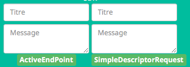

########################################
Debug / Troubleshooting / Investigations
########################################

Je vais essayer de consolider ici tous les retours d'expériences et les vérifications à faire pour résoudre un éventuel problème.

*****
Forum
*****

* Liste des sujets en cours de discussions: `Forum Jeedom <https://www.Jeedom.com/forum/viewtopic.php?f=59&t=33573&hilit=Abeille>`_

* Liste des sujets en investigations : `GitHub Abeille <https://github.com/KiwiHC16/Abeille/issues?utf8=✓&q=is%3Aissue>`_

*********
Problèmes
*********

Si vous trouvez un problème qui demande une correction dans le plugin, merci d ouvrir ùne issue <https://github.com/KiwiHC16/Abeille/issues>`_  dans GitHub.

Si vous ouvrez une "issue" merci de fournir le plus d'information possible et en particulier:

Votre configuration Jeedom:
 * Le HW sur lequel vous faite tourner le plugin,
 * la Version de l'OS,
 * la version de Jeedom
 * ...

Votre configuration Gateway
 * Type de Zigate
 * quel firmware
 * ...

Les logs, aussi nombreux que possibles surtout
 * AbeilleParser
 * AbeilleMQTT
 * Abeille
 * ...

Description
 * ce que vous cherchez à faire
 * les résultats
 * captures d'ecrans
 * ...

*********
Evolution
*********

Si vous souhaitez une évolution dans le plugin, merci d ouvrir une "issue" dans GitHub à l'adresse avec un "Labels" "enhancement": https://github.com/KiwiHC16/Abeille/issues

*****
Debug
*****

Configuration
=============

* Verifier la configuration réseau et en particulier /hostname, /etc/hosts
* Vérifier la configuration du plugin. Par exemple le message suivant indique très probablement que l'objet de rattachement de l'équipement Ruche n'est pas défini.

.. code-block:: php
   :linenos:

   [MySQL] Error code : 23000 (1452). Cannot add or update a child row: a foreign key constraint fails (`Jeedom`.`eqLogic`, CONSTRAINT `fk_eqLogic_object1` FOREIGN KEY (`object_id`) REFERENCES `object` (`id`) ON DELETE SET NULL ON UPDATE CASCADE)

Connection
==========

Premier test
------------

* Rendez l équipement Ruche Visible (Il est maintenant caché par défaut).
* Dans l équipement ruche, appuyez sur le bouton "Version", vous devez récupérer la version logicielle dans le champ SW, la version de dev dans le champ SDK et les dates Last et Lasts Stamps doivent se mettre à jour à chaque fois. Si les dates se mettent à jour c'est que le dialogue Abeille-Zigate fonctionne dans les deux sens.

Deuxième test
-------------

* Vérifiez bien que vous n'avez pas plusieurs Plugins essayant d'utiliser le même port série (/dev/ttyUSBx).

Troisième test
--------------

* Tester la Zigate en ligne de commande (ssh)

On envoie

.. code-block:: php
   :linenos:

   stty -F/dev/ttyUSB0 115200 <1>
   echo -ne '\x01\x02\x10\x49\x02\x10\x02\x14\xb0\xff\xfc\xfe\x02\x10\x03' > /dev/ttyUSB0 <2>

<1> On configure le port série

<2> On demande à la zigate de se mettre en inclusion.

(Cela peut être fait alors que le plugin est Zigate fonctionnent).

Cette commande demande à la Zigate de se mettre en Inclusion, vous devriez voir la LED bleu se mettre à clignoter et dans le log AbeilleParser vous devriez voir passer un message comme:

.. code-block:: php
   :linenos:

   AbeilleParser 2018-02-28 04:21:32[DEBUG]-------------- 2018-02-28 04:21:32: protocolData size(20) message > 12 char
   AbeilleParser 2018-02-28 04:21:32[DEBUG]Type: 8000 quality: 00
   AbeilleParser 2018-02-28 04:21:32[DEBUG]type: 8000 (Status)(Not Processed)
   AbeilleParser 2018-02-28 04:21:32[DEBUG]Length: 5
   AbeilleParser 2018-02-28 04:21:32[DEBUG]Status: 00-(Success)
   AbeilleParser 2018-02-28 04:21:32[DEBUG]SQN: b8

Si la LED bleue clignote cela confirme que le dialogue Abeille vers Zigate fonctionne.

PS: la configuration du port peu varier d'un système à l'autre donc il peut être nécesaire de jouer avec stty en rajoutant les arguments raw, cs8, -parenb et autres.

Quatrième test
--------------

Arretez le plugin Abeille. Lancer la commande dans un terminal (Ecoute):

.. code-block:: php
   :linenos:

   cat /dev/ttyUSB0 | hexdump -vC

Dans un second terminal envoyez la commande

.. code-block:: php
   :linenos:

   stty -F/dev/ttyUSB0 115200
   echo -ne '\x01\x02\x10\x49\x02\x10\x02\x14\xb0\xff\xfc\xfe\x02\x10\x03' > /dev/ttyUSB0

Dans le premier terminal (Ecoute) vous devriez voir passer du traffic comme:

.. code-block:: php

   www-data@Abeille:~/html/log$ cat /dev/ttyUSB0 | hexdump -vC
   00000000  01 80 02 10 02 10 02 15  77 02 10 bb 02 10 49 02  |........w.....I.|
   00000010  10 03 01 80 02 10 02 10  02 15 70 02 10 bc 02 10  |..........p.....|

Cela confirme Zigate vers Jeedom

Equipements ZigBee
==================

La ruche possede des commandes pour interroger les objets. Les deux principales sont ActiveEndPoint et SingleDescriptorRequest.

Dans ActiveEndPoint mettre l'adresse de l'équipement dans le titre puis clic sur le bouton ActiveEndPoint.

Regardez dans la log AbeilleParser, vous devez voir passer la réponse. Par exemple pour une ampoule IKEA:

.. code-block:: php

   AbeilleParser: 2018-02-06 17:40:16[DEBUG]-------------- 2018-02-06 17:40:16: protocolData
   AbeilleParser: 2018-02-06 17:40:16[DEBUG]message > 12 char
   AbeilleParser: 2018-02-06 17:40:16[DEBUG]Type: 8045 quality: 93
   AbeilleParser: 2018-02-06 17:40:16[DEBUG]type: 8045 (Active Endpoints Response)(Not Processed)
   AbeilleParser: 2018-02-06 17:40:16[DEBUG]SQN : da
   AbeilleParser: 2018-02-06 17:40:16[DEBUG]Status : 00
   AbeilleParser: 2018-02-06 17:40:16[DEBUG]Short Address : 6e1b
   AbeilleParser: 2018-02-06 17:40:16[DEBUG]Endpoint Count : 01
   AbeilleParser: 2018-02-06 17:40:16[DEBUG]Endpoint List :
   AbeilleParser: 2018-02-06 17:40:16[DEBUG]Endpoint : 01

Il y a, dans ce cas, une seul EndPoint à l'adresse "01" (Donné par les lignes suivant "Endpoint List").

Faire de même pour SingleDescriptorRequest en ajoutant le EndPoint voulu dans le champ Message.

.. code-block:: php

   AbeilleParser: 2018-02-06 17:42:25[DEBUG]-------------- 2018-02-06 17:42:25: protocolData
   AbeilleParser: 2018-02-06 17:42:25[DEBUG]message > 12 char
   AbeilleParser: 2018-02-06 17:42:25[DEBUG]Type: 8000 quality: 00
   AbeilleParser: 2018-02-06 17:42:25[DEBUG]type: 8000 (Status)(Not Processed)
   AbeilleParser: 2018-02-06 17:42:25[DEBUG]Length: 5
   AbeilleParser: 2018-02-06 17:42:25[DEBUG]Status: 00-(Success)
   AbeilleParser: 2018-02-06 17:42:25[DEBUG]SQN: db
   AbeilleParser: 2018-02-06 17:42:25[DEBUG]-------------- 2018-02-06 17:42:25: protocolData
   AbeilleParser: 2018-02-06 17:42:25[DEBUG]message > 12 char
   AbeilleParser: 2018-02-06 17:42:25[DEBUG]Type: 8043 quality: 93
   AbeilleParser: 2018-02-06 17:42:25[DEBUG]Type: 8043 (Simple Descriptor Response)(Not Processed)
   AbeilleParser: 2018-02-06 17:42:25[DEBUG]SQN : db
   AbeilleParser: 2018-02-06 17:42:25[DEBUG]Status : 00
   AbeilleParser: 2018-02-06 17:42:25[DEBUG]Short Address : 6e1b
   AbeilleParser: 2018-02-06 17:42:25[DEBUG]Length : 20
   AbeilleParser: 2018-02-06 17:42:25[DEBUG]endpoint : 01
   AbeilleParser: 2018-02-06 17:42:25[DEBUG]profile : c05e
   AbeilleParser: 2018-02-06 17:42:25[DEBUG]deviceId : 0100
   AbeilleParser: 2018-02-06 17:42:25[DEBUG]bitField : 02
   AbeilleParser: 2018-02-06 17:42:25[DEBUG]InClusterCount : 08
   AbeilleParser: 2018-02-06 17:42:25[DEBUG]In cluster: 0000 - General: Basic
   AbeilleParser: 2018-02-06 17:42:25[DEBUG]In cluster: 0003 - General: Identify
   AbeilleParser: 2018-02-06 17:42:25[DEBUG]In cluster: 0004 - General: Groups
   AbeilleParser: 2018-02-06 17:42:25[DEBUG]In cluster: 0005 - General: Scenes
   AbeilleParser: 2018-02-06 17:42:25[DEBUG]In cluster: 0006 - General: On/Off
   AbeilleParser: 2018-02-06 17:42:25[DEBUG]In cluster: 0008 - General: Level Control
   AbeilleParser: 2018-02-06 17:42:25[DEBUG]In cluster: 0B05 - Misc: Diagnostics
   AbeilleParser: 2018-02-06 17:42:25[DEBUG]In cluster: 1000 - ZLL: Commissioning
   AbeilleParser: 2018-02-06 17:42:25[DEBUG]OutClusterCount : 04
   AbeilleParser: 2018-02-06 17:42:25[DEBUG]Out cluster: 0000 - General: Basic
   AbeilleParser: 2018-02-06 17:42:25[DEBUG]Out cluster: 0003 - General: Identify
   AbeilleParser: 2018-02-06 17:42:25[DEBUG]Out cluster: 0004 - General: Groups
   AbeilleParser: 2018-02-06 17:42:25[DEBUG]Out cluster: 0005 - General: Scenes

Nous avons maintenant les clusters supportés par cet objet sur son endpoint 01.

Script
======

Dans Abeille/resources/AbeilleDeamon/Debug, vous trouverez le script verification.sh.

L'execution permet de tester, vérifier et donner des infos qui sont souvent interessantes pour des problème de base. Ce script n'est pas forcement bien maintenu alors les résultats ne sont pas forcement fiables.

Je ne suis pas sûre que ce script soit toujours à jour...

Messages
========
Les different module d'Abeille discutent entre eux par message passing. Ils est possible de voir l'etat avec la commande ipcs (en ssh).

.. code-block:: php

  ------ Files de messages --------
  clef       msqid      propriétaire perms      octets utilisés messages
  0x0000007b 0          www-data   666        0            0
  0x000000df 32769      www-data   666        0            0
  0x00000143 65538      www-data   666        0            0
  0x00000141 98307      www-data   666        0            0
  0x0000020b 131076     www-data   666        0            0
  0x0000026f 163845     www-data   666        0            0
  0x000002d3 196614     www-data   666        0            0
  0x00000336 229383     www-data   666        0            0
  0x00000079 262152     www-data   666        0            0
  0x000000dd 294921     www-data   666        0            0
  0x000001a5 327690     www-data   666        0            0
  0x0000026d 360459     www-data   666        0            0
  0x0000007c 393228     www-data   666        0            0
  0x000000e1 425997     www-data   666        0            0

Ici on voit dans la derniere colonne qu'il n'y a pas de message en attente, ils ont tous été traités.
