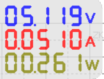

########
HardWare
########

***
USB
***

Consommation d'une zigate en mode USB:

Sous une tension de 5V, consommation de 51mA, soit 261mW.

****
Wifi
****

Consommation d'une zigate en mode Wifi:

(mesure a faire).

********
PiZigate
********

Consommation d'une PiZigate:

(mesure a faire).
