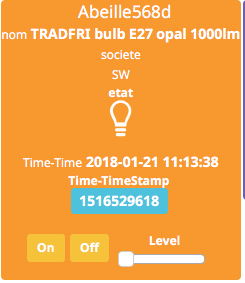
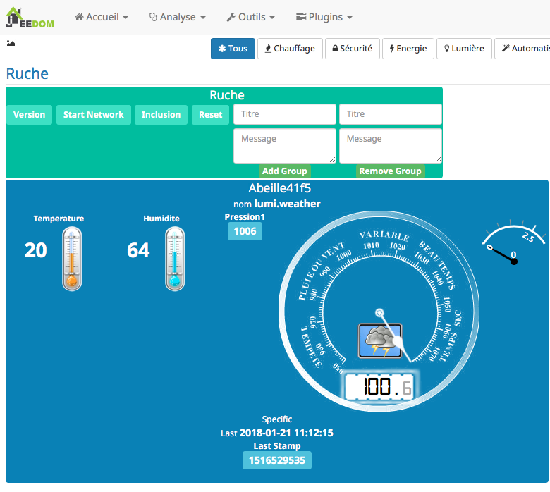
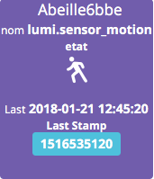

#########
Inclusion
#########

*********
Inclusion
*********

Inclusion de nouveaux périphériques Zigbee

Exemple 1
=========

Exemple d'ajout d'équipements courants (S'ils ne sont pas déjà dans le réseau Zigbee)

* Mettre la Zigate en mode inclusion (Bouton Inclusion), la Led bleue de la Zigate doit clignoter...

puis:

* Ampoules IKEA: faire un reset de l'ampoule en partant de la position allumée, puis 6 fois, éteindre-allumer. Il n'est pas facile d'avoir le reset... et après maintes tentatives, vous devriez récupérer l'ampoule dans Jeedom. Autre solution bien plus simple utiliser une télécommande Philips Hue (Hue Dimmer Switch) et forcer le reset par un bouton I + bouton O appuyés suffisamment longtemps. Une fois associée, il est possible d'avoir besoin d'éteindre, attendre 10 secondes et allumer.

* Xiaomi : Capteur de porte, prise, capteur de température rond/carre, bouton et capteur infrarouge : un appuie long (plus de 6s, led flash, attendre plusieurs flash avant de lâcher) sur le bouton sur le côté. Et vous devriez récupérer l'objet dans Jeedom.

* Porte

.. image:: images/Capture_d_ecran_2018_01_21_a_11_11_38.png

* Température rond

.. image:: images/Capture_d_ecran_2018_01_21_a_11_12_43.png

* Température Carre

* Bouton

.. image:: images/Capture_d_ecran_2018_01_21_a_11_13_15.png

État: passe à 1 quand vous appuyez sur le bouton. Deux, Trois et Quatres appuies apparaissent dans le champ multi.

* Capteur Présence InfraRouge

* Objet inconnu: Si le type d'objet n'est pas connu, Abeille va créer un objet vide.

.. image:: images/Capture_d_ecran_2018_01_21_a_12_49_06.png

Exemple 2
=========

Exemple d'ajout d'équipements courants (S'ils sont déjà dans le réseau Zigbee)

* Ampoule IKEA: éteindre, attendre 15 secondes et allumer électriquement l'ampoule et elle doit réapparaître dans Jeedom.
* Xiaomi : Capteur de porte, capteur de température rond/carre et bouton : un appuie rapide sur le bouton latérale et il doit réapparaître dans Jeedom.
* Capteur InfraRouge Xiaomi: pas implémenté.
