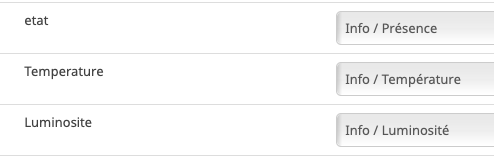

###########
Philips Hue
###########

*********
Ampoule 1
*********

Ampoule Philips Hue White

Nouvelle inclusion
==================

* Mettre la Zigate en mode inclusion (Bouton Inclusion), la Led bleue de la Zigate doit clignoter...
* Avec une ampoule neuve Hue White
	* Allumer l'ampoule, elle s'associe et envoie des messages "annonce" mais pas son nom.
	* Si vous faites un getName avec son adresse courte dans le champ Titre et 0B (destinationEndPoint) dans le champ Message, alors elle doit répondre avec son nom, ce qui va créer l'objet dans Jeedom.

Déjà inclue
===========

* Zigate en fonctionnement normale
* Éteindre l'ampoule 15s puis la rallumer

Déjà inclue 2
=============

préalablement sur un autre réseau Zigbee

* Zigate en fonctionnement normale
* Avec une Télécommande Hue, Bouton "I" et "0", pour remettre d'usine l'ampoule.
* Faire une inclusion standard.

*********
Ampoule 2
*********

Philips Hue Go

Nouvelle inclusion
==================

* Mettre la Zigate en mode inclusion (Bouton Inclusion), la Led bleue de la Zigate doit clignoter...
* Appui très long sur le bouton arrière de l'ampoule plus de 40s, un objet doit apparaître dans Jeedom.

Déjà inclue
===========

* Zigate en fonctionnement normale
* Appui très long sur le bouton arrière de l'ampoule plus de 40s
* La lampe se met à flasher. Elle s'est déconnectée du réseau.

*********
Dimmer
*********

Philips Hue Dimmer Switch (Télécommande)

- Elle permet de faire une reset touchlink d'une ampoule Ikea
- elle peut fonctionner seule avec une ampoule (TouchLink): On/Off/+/-
- elle peut s'inclure dans le réseau zigate
- Abeille peut la configurer pour qu'elle envoie l'information du bouton appuyé. Abeille peut utiliser cette info dans un scénario par exemple.
- Je ne sais pas comment faire en sorte qu'elle commande une ampoule en direct

Nouvelle inclusion
==================

* Mettre la Zigate en mode inclusion (Bouton Inclusion), la Led bleue de la Zigate doit clignoter...

* Appui avec un trombone 5x sur le bouton "setup" en face arrière. Un objet télécommande doit être créé dans Abeille.

Groupe
======

Récupérer le groupe utilisé

* Approcher la télécommande d'une ampoule de test qui est sur le réseau.
* Faire un appui long >10s sur le I de la télécommande.
* Attendre le clignotement de l'ampoule.
* Si vous appuyez sur I ou O, elle doit s'allumer et s'éteindre.
* Et les bouton lumière plus et moins doivent changer l'intensité.
* Ensuite vous pouvez récupérer le groupe en interrogeant l'ampoule depuis la ruche avec un getGroupMembership.

Reset
=====

Reset d une ampoule

 * Appuyer sur I et O en même temps à moins de quelques centimètres d'une ampoule
 * L'ampoule doit faire un reset et essayer de joindre un réseau.
 * Si la Zigate est en mode inclusion alors vous récupérez votre ampoule.

Informations
============

Informations supplémentaires

Dans l'objet Abeille vous allez trouver:

* 8 informations. 4 boutons x 2 infos (événement, durée)
	* Ce sont les informations qui remontent de la télécommande quand vous l'utilisez.
	* Cela permet à Jeedom de savoir qu'un bouton a été utilisé et vous pouvez créer les scénario que vous voulez.
* 4 Boutons: "I", "LumPlus", "LumMoins", "O".
* 4 types events: "Appui Court = 0", "Appui Long = 1", "Relâche appui court = 3", "Relâche Appui Long = 4"
* Durée, indique le temps d'appui d'un bouton (Il n'y pas de temps de nom appui).

• 00 appui
• 01 appui maintenu
• 02 relâche sur appui court
• 03 relâche sur appui long

* 5 icônes (On,Off,Toggle,Lumière plus, Lumière moins) pour simuler la télécommande depuis Jeedom.

C'est Jeedom qui envoie les commandes à la place de la télécommande. Pour se faire renseigner le champ "Groupe" dans la configuration.

*********
Prise
*********

Prise de contrôle d'une ampoule

* Ampoule Hue White et télécommande déjà associées au réseau :
	* Mettre la télécommande proche de l ampoule et appuyer sur "I" assez longtemps.
	* L'ampoule clignote et est configurée.
	* Après l'ampoule est pilotable par la télécommande. On peut récupérer le groupe utilisé sur l'ampoule dans Jeedom.

* Ampoule Ikea et télécommande déjà associées au réseau :
	* La configuration depuis la télécommande et le bouton 'I' ne fonctionne pas comme avec l'ampoule Hue.
	* Mais si on récupère le groupe comme indiqué au paragraphe précédent et qu'on défini ce groupe dans l'ampoule Ikea, alors l'ampoule répond aux commandes de la télécommande.

********************
Motion Sensor Indoor
********************

Inclusion
=========

Mettre la zigate en inclusion, puis un appui sur le bouton "setup" et l'objet doit se créer dans Abeille.

Présence
========

En cas de détection le capteur envoie l information à la zigate qui transmet à Abeille. A vous de faire les scénairii que vous souhaitez. Ce capteur ne permet pas de piloter en direct sans la zigate un autre équipement à ma connaisssance.

Luminosité
==========

Le capteur remonte régulièrement la luminosité mesurée. Cela vous permet par exemple de faire de scénario en fonction du jour et de la nuit, vérifier que des lumières sont allumées dans une pièce,...
Voir aussi https://en.wikipedia.org/wiki/Lux pour avoir une idée de l'intensité lumineuse, une table fournie des indications interessante.

***********
Température
***********

La température remonte régulièrement.

Batterie
========

(A tester)

Homebridge
==========

*********************
Motion Sensor Outdoor
*********************

voir motion sensor indoor.
