#####
Radio
#####

La solution zigbee fonctionne sur la base d'ondes radios. Je vais essayer dans cette page de vous partager des informations pour optimiser votre installation.

La bande de fréquence utilisée est autour de 2.4GHz comme le wifi. Cette bande de fréquence est sub-divisée en 16 canaux numérotés de 11 à 26 pour le zigbee. Le wifi utilise cette même bande mais de façon différente avec des canaux bien plus larges numérotés de 1 à 13. Ne pas confondre les deux. Le Bluetooth utilise lui aussi cette bande de fréquences.

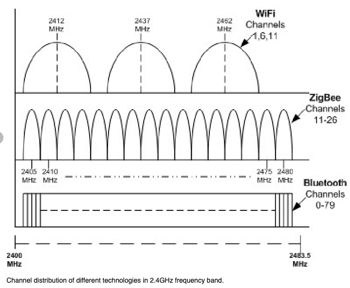

Avec tous ces utilisateurs les ondes radios peuvent être saturées et nous poser quelques soucis. Pour ceux qui n'ont pas l'habitude de jouer avec les ondes radios vous pouvez imaginer que chaque équipement possède une lampe torche qu'il utilise pour dialoguer avec un autre équipement en morse lumineux. Dans la cas du zigbee ces lampes torches ne sont pas très puissantes pour réduire au maximum l'énergie utilisée de la batterie. De même que la lumière ne passe pas les murs, les ondes radios sont fortement impactées par les obstacles. Dans le cas idéal où deux équipements sont visibles l'un de l'autre on peut atteindre une distance de 17 ou 20 mètres mais la liaison n'est pas stable. En pratique, perso je ne recommande pas plus de 10m et en cas d'obstacles encore moins.

Une grosse difference entre le zigbee et le wifi est que l'un fonctionne en réseau maillé et l'autre en réseau étoile. Le Wifi possède un Access Point (Borne) centrale et tous les équipements (ordinateurs,...) se connectent à celle ci. Pour discuter entre eux, ils sont obligées de passer par la borne. Par contre le zigbee est une réseau maillé, ce qui veut dire que tous les équipements peuvent parler avec tous les équipements. De ce fait la zone couverte par le wifi est un disque avec pour centre la borne wifi. Pour le zigbee, celui ci peut s'étendre de proche en proche. Si on prend deux équipements alors on attend une distance de 10m. Avec 3 équipements on arrive à 20m, avec 4: 30m, avec 5: 40m, avec 6: 50m,...

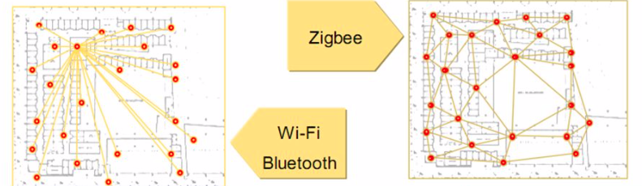

Mais un réseau maillé doit s'organiser pour propager les messages. C'est comme à la poste, vous mettez l'adresse sur l'enveloppe, vous donner l'enveloppe au facteur, qui la donner au prochaine facteur en fonction de l'adresse, etc. Ca suppose que les facteurs connaissent les autres facteurs et s'ils sont capables de distribuer l'enveloppe au prochain facteur jusqu'à destination. La magie de Zigbee est que tous les équipements sur secteur (220V) sont des facteurs, qu'ils discutent entre eux, s'organisent et que tous cela est transparent pour nous utilisateurs.

Maintenant que faire si notre enveloppe n'arrive jamais à destination. Par exemple depuis Jeedom on envoie une demande d'allumage d'une ampoule et celle ci ne réagit pas. Comme dit ci dessus, les facteurs (routeurs) s'auto-organise et nous ne pouvons pas les forcer. Heureusement, ils partagent certaines informations si on leur demande. Par exemple, il partage les LQI.

LQI ?
Cela veut dire Link Quality Index. C'est un indicateur de la qualité d'une liaison entre deux équipements. Chaque routeur peut nous dire les équipements qu'il voit et avec qu'elle qualité. Abeille récupère ces informations et fait des graphes permettant de les visualiser. Si dans votre cas l'ampoule destinatrice n'est visible de personne il est normale qu'elle ne reçoive jamais son message... Il sera probablement nécessaire de la déplacer ou d'ajouter un routeur à mi chemin pour arriver à la joindre.

Pour voir ce qu'il se passe vous pouvez accéder à ces trois représentations:

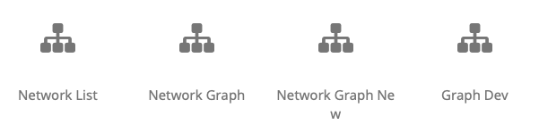

("Network Graph" et "Network Graph New" sont identiques. "Network Graph" est la premiere version développée en dehors de Jeedom et qui doit trouver sa place dans Jeedom sous le nom "Network Graph New" mais je ne parviens pas à faire fonctionner le drag and drop dans Jeedom, donc les deux sont disponibles.)

.. important::

    Dans les graphes suivants ce n'est pas le chemin suivi par les messages qui est représenté mais la qualité des liens entre équipements. Les routes suivies par les messages n'est pas accessible. Il est for probable qu'un message prenne un chemin de bonne qualité mais le réseau peut en decider autrement. En gros vous avez la carte IGN mais le GPS de votre voiture peut en decider autrement.

.. important::

    Gardez en tête que le réseau peut évoluer (ajout, retrait d'équipement, obstacle ajouté,...) et qu'aucune information n'est valide pour l'éternité. Donc chaque valeur est conservée un certain temps puis effacée ou rafraichie si une information permet de le faire. Par example vous pouvez très bien avoir une ampoule A dire voir l ampoule B, puis 10 minutes plus tard dire ne plus la voir simplement car elle ne la pas entendu discuter depuis 20 minutes.

Zigate Channel Selection
========================

Pour l instant le mask doit être défini à la main, je verrai comment faire une belle interface plus tard. Vous devez definir les canaux qui sont authorisés pour la zigate.

Si 1 canal authorisé, si 0 canal pas authorisé.

Au démarrage la zigate choisira parmi ces canaux en fonction de sa mesure d occupation du canal.

Dans le zigbee vous avez les canaux 11 à 26 disponibles.

Le mask couvre les canaux 0 à 31. De ce fait il faut positionner à 0 les canaux 0 à 10 et les canaux 27 à 31, on commence par canal 31 et on fini par canal 0 => 00000xxxxxxxxxxxxxxxx00000000000

Les x étant les canaux 26 à 11. Si vous voulez tous les activer alors le mask vaut: 00000111111111111111100000000000 (en Hexa: 0x07FFF800)

Si vous ne voulez que le canal 26 alors ca donne: 00000100000000000000000000000000 (en Hexa: 0x04000000)

Si vous ne voulez que le canal 20 alors ca donne: 00000000000100000000000000000000 (en Hexa: 0x00100000)

Si vous ne voulez que le canal 15 alors ca donne: 00000000000000001000000000000000 (en Hexa: 0x00008000)

Dans le champ il faut mettre la valeur en hexa. Il faut bien 8 digit sans le 0x devant.

Pour convertir le binaire en hexa vous avez: https://www.binaryhexconverter.com/binary-to-hex-converter

Network List
============

Depuis le menu: Plugins->Protocole Domotique->Abeille->Network List vous allez arriver sur une page contenant 3 volets.

Résumé
------

Le résumé vous donne un aperçu de l'état du plugin.

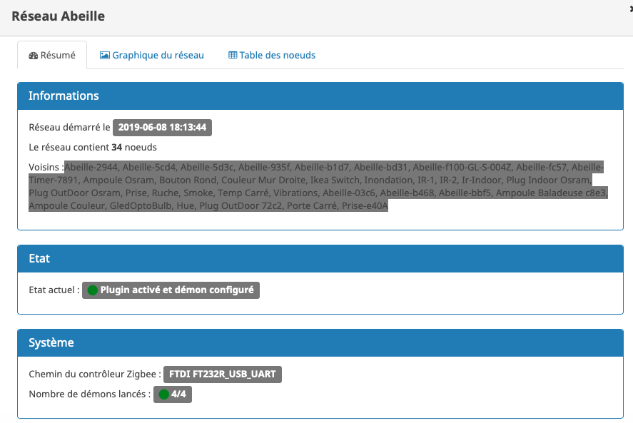

Graphique
---------

Le graphique représente la situation de votre réseau

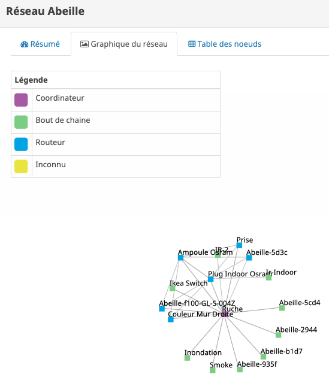

Table
-----

La table contient les informations nécessaire à la représentation du réseau plus des informations radios très interessantes.

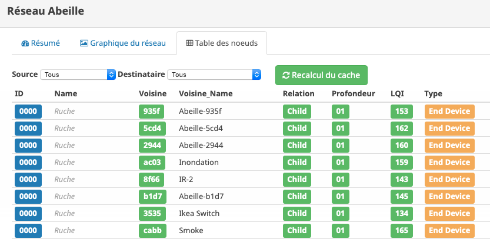

Abeille demande toutes les nuits aux équipement de fournir les informations sur les équipements qu'ils ont dans leur entourage radio.
Une ligne représente une relation radio entre l'équipement et un équipement voisin.
Vous allez y trouver le type de relation, le LQI, etc.
Le LQI est le "Link Quality Radio" qui représente la Qualité de la liaison radio entre les deux équipements. Evidemment si cette qualité est mauvaise alors les messages ne peuvent pas être échangés et le réseau ne fonctionne pas. Ou disons le réseau ne peut utiliser ce lien. Pour des valeur inférieures à 50 (valeur empirique) il faut essayer d'améliorer les choses.

Normalement après 24h les informations sont disponibles (Rafraichissement la nuit). Si vous n'avez pas les 24h ou souhaiter rafraichir les données, il faut avoir fait un "Recalcul du cache" (Network List->Table des noeuds->Recalcul du cache).

Vous pouvez suivre l'avancement de l interrogation du réseau en tête de page:

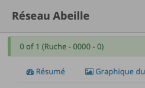

Soyez patient ca peut être assez long.

Network Graph
==============

Juste ouvrir le graph et les Abeilles seront disposées sur un grand cercle. Vous pourrez déplacer les Abeilles (clic, deplacement, relache).

.. image:: images/Capture_d_ecran_2018_10_04_a_02_24_10.png

Le menu sous le graphe permet de modifier l'affichage:

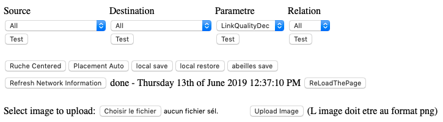

Filtrage
--------

Vous pouvez choisir les équipements Dources et les équipements Destination afin de ne voir que les relations pour un équipement.

Par exemple si vous souhaitez voir les équipements qui disent voir la ZiGate(Ruche) vous mettez "none" dans la source et "Ruche" dans la destination.

Par exemple si vous souhaitez voir les équipements vus par la ruche vous mettez "Ruche" pour la source et "All" pour la destination.

Puis vous clic sur test.

Vous pouvez choisir la valeur affichée auprès de chaque lien en sélectionnant "Parameter", ou le type de relation en sélectionnant le champ "Relation".

Utilisation du filtre par l'exemple:

* Je veux voir toutes les Abeilles vues par la ruche (Zigate). Je choisi Ruche dans la source et none dans destination.

* Je veux représenter qui voit la sonnette. Je choisi Sonnette dans la destination et none dans la source.

* Je veux voir toutes les relations Child. Je mets All dans Source et Destination, Child dans Relation.

* Je choisi la valeur affichée le long de la ligne avec le parametre. Le plus utilisé probablement est LinkQualityDec qui represente la qualité de la relation radio dans le sens Source - Destination. Le nombre est entre 0 et 250. Pour des équipments proches d'environ 20cm j'ai des valeurs autour de 180. Au dessus de 220, je me dis que la valeur est farfelue surtout quand elle vaut 255. Tous les équipements ne semblent pas remonter des infos pertinentes. En dessous de 50 la liaison est vraiment pas bonne, il faut probablement faire quelque chose comme ajouter un routeur.

Positionnement
--------------

Vous pouvez positionner sur la page les équipements par un drag and drop.
Le bouton "Ruche Centered" positionne la Ruche(ZiGate) au centre.
Le bouton "Placement Auto" positionnera tous les équipements sur un cercle.
"Local Save" et "Local Restore" permet de sauvegarder les positions dans votre browser web.
"Abeille Save" sauvegarde les positions dans Abeille/Jeedom et quand vous rouvrirez ce graphe, les équipements seront a cette position.
"Refresh Network Information" permet d'interroger le réseau.
Vous pouvez choisir un fond de page par exemple un plan de votre maison.

Exemples
--------

Exemple avec tout positionné à la main:

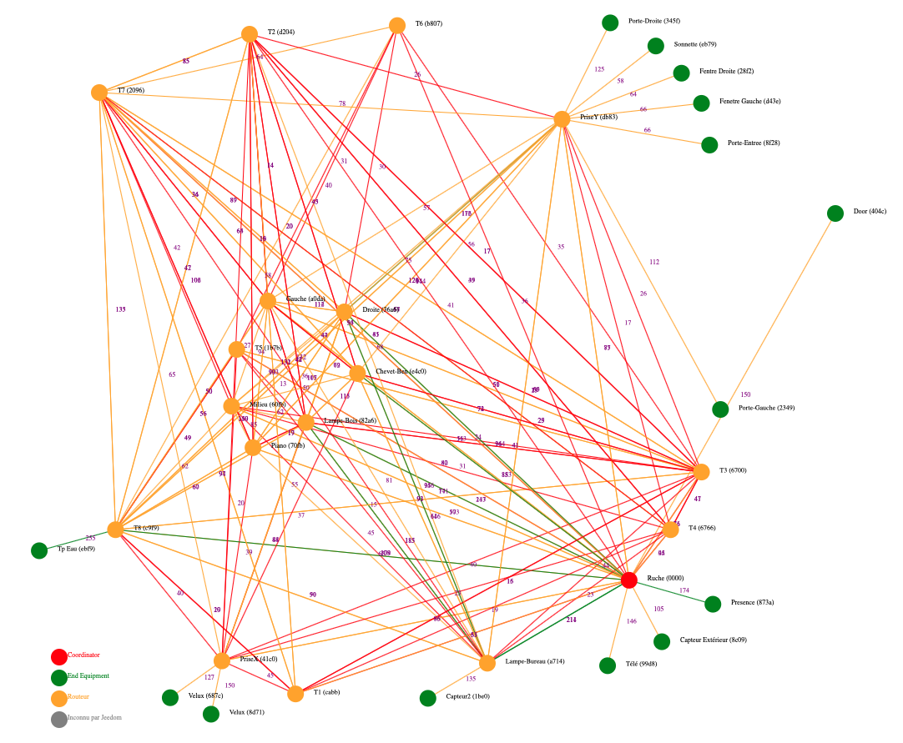

Exemple qu'avec les relations Child (Filter Child):

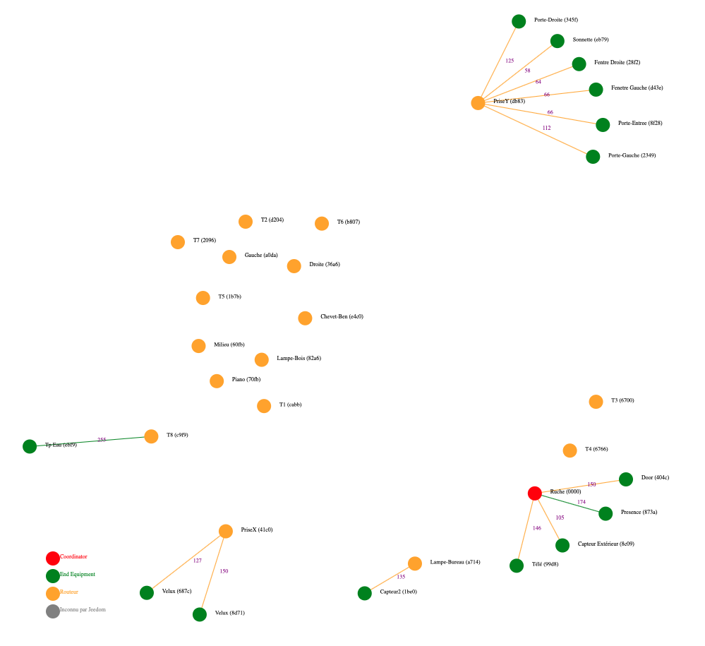

On peut voir ici que j'ai 4 End Device sur la ruche(Zigate), 5 sur la priseY,...

Vue interressante car elle permet de voir quels sont le équipements terminaux rattachés à quels routeurs.

Exemple en demandant la Ruche au centre:

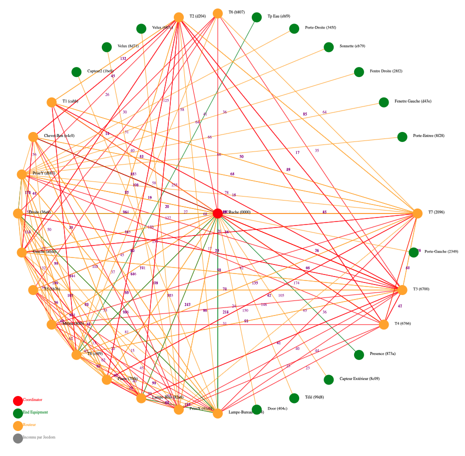

Exemple avec l'upload d'une image en fond d'écran:

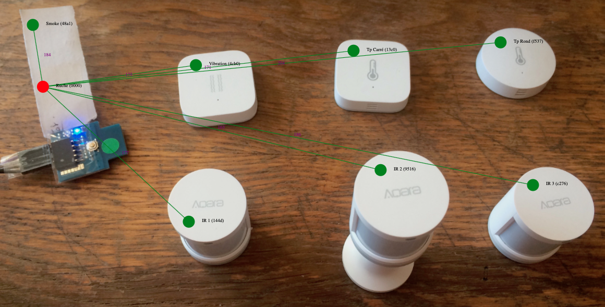

Vous pouvez aussi choisir votre fond d'écran pour positionner vos Abeilles.

Network Graph
=============

Etudes
=============

Maintenant qu'Abeille collecte des informations directement du réseau je me suis amusé à faire quelques études.

Couverture
----------

Sur la base de la collecte de ces informations, j'ai fait quelques graphes pour comprendre ce qu'on espérer en terme de couverture radio.

Je n'ai pris que des routeurs dans cet exercice: prise xiaomi, prise ikea, ampoule ikea.
Comme tout est mélangé: type de routeur, types de murs (Fenetre, Bois, Pierre,...), Distances définies à vue d'oeil,.. cela permet d'avoir une vue d'un réseau réel.

Le premier graphe est le LQI rapporté par l'équipement en fonction du nombre de mur à traverser.
Le deuxième graphe est le LQI en fonction de la distance à vol d'oiseau.

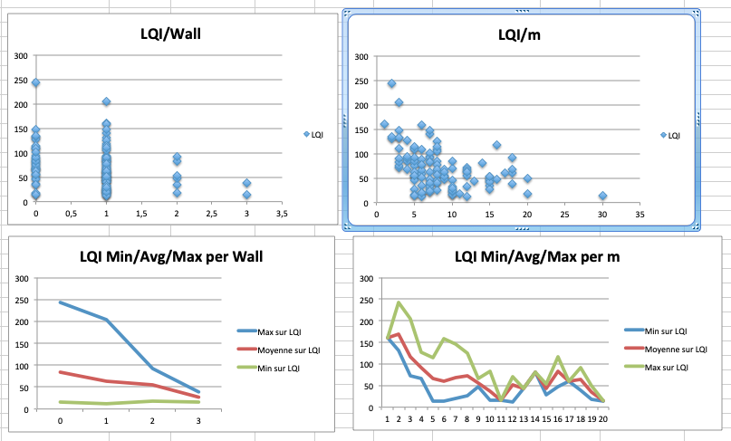

Si l'on considère qu'avec un LQI inférieur à 50 la liaison radio est compliquée (basé sur une expérience partagée mais en rien mesurée) il faut resté dans la mesure du possible au dessus.

Cela nous indique qu'en moyenne plus de 2 murs est très compliqué. Ce qui implique un routeur dans chaque pièce pour être tranquille.

On peut voir des écarts très important dans le LQI alors que les équipements sont dans la meme piece (Colonne 0 des graphes LQI/Wall).

Pour le LQI/m, on peut dire que jusqu'à 10m c'est jouable. Mais on peut trouver les extrèmes aussi. Exemple: la Zigate et une ampoule ikea à 16m pour un LQI de 117 alors que deux ampoules à 5 m on un LQI de 15.

Je suppose qu'en environnement ouvert on peut avoir des distances bien supérieures, avec des distances annoncées par les fabriquants jusqu'a 100m, mais ce type de situation sera des plus rares...

/////////////////////////////////////////////////////////////////

Routage
=======

Les chapitres suivants ne sont pas disponibles dans Abeille et nécessitent un sniffer Zigbee associé à Wireshark. Disons que c'est pour les utilisateurs très très avancés. Il est fort probable d'avoir à adapter le code...

Link Status
-----------

Afin de comprendre la situation radio de votre réseau, vous pouvez utiliser ce script RadioVoisinesMap.php et visualiser les résultats dans un browser web:

http://[Jeedom]/plugins/Abeille/Network/RadioVoisinesMap.php

Ce script va présenter graphiquement les informations échangées entre les routeurs dans les messages "Link Status".

Faites une capture du trafique avec Wireshark, puis faites une sauvegarde JSON sous essai.json:

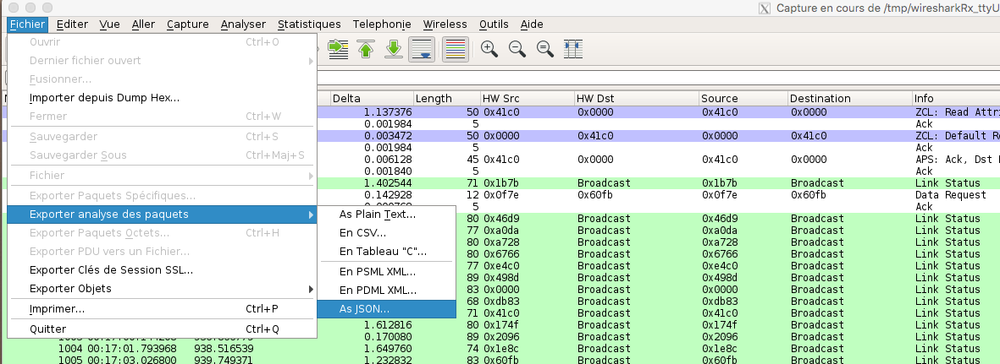

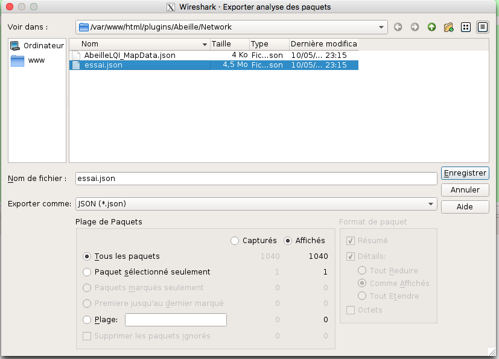

Une fois cela fait ouvrez la page: http://[Jeedom]/plugins/Abeille/Network/RadioVoisinesMap.php

Vous devriez avoir un résultat comme:

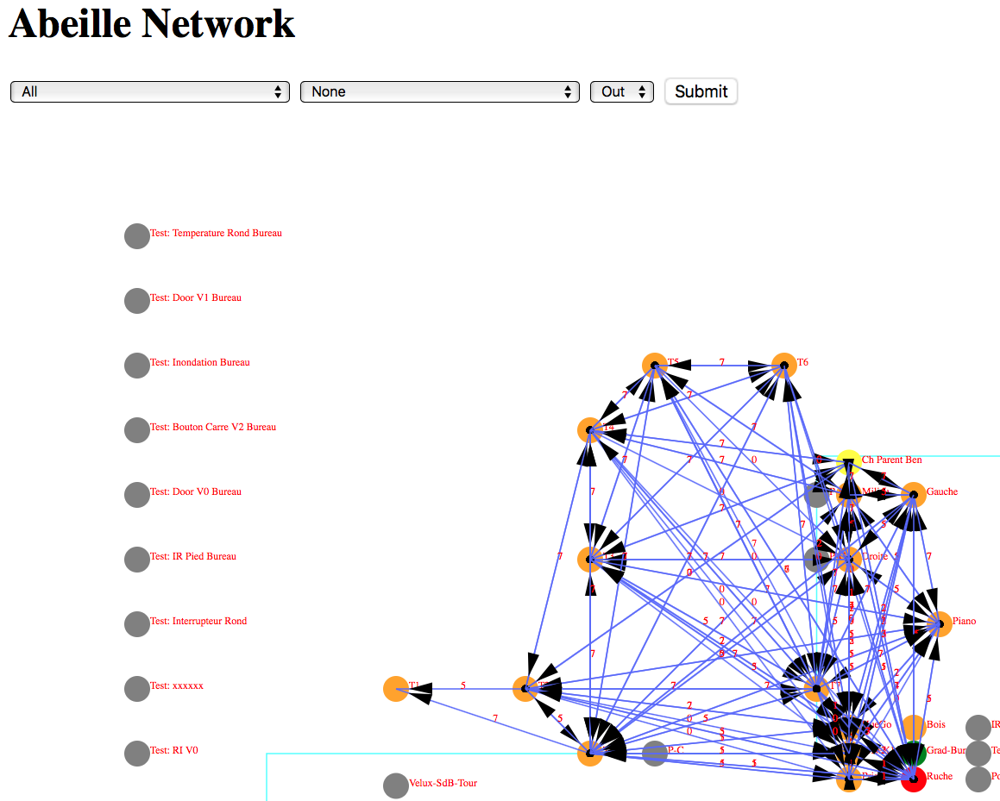

Dans le menu déroulent le premier champ permet de filtrer les enregistrement qui ont pour adresse de source la valeur sélectionnée. Idem pour le deuxième champ mais pour l'adresse destination. Et enfin le dernier champ permet d'afficher la valeur du champ In ou du champ Out. La valeur In ou Out est la dernière valeur trouvée dans le fichier json lors de son analyse.

Evidement la configuration est celle de mon réseau de prod et de mon réseau de test donc il vous faut déclarer votre propre réseau dans le fichier NetworkDefinition.php.

Dans le tableau knowNE mettre l'adresse courte suivie du nom de l'équipement:

.. code-block:: php
   :linenos:

   $knownNE = array(
   "0000" => "Ruche",         // 00:15:8d:00:01:b2:2e:24 00158d0001b22e24 -> Production
   // 00:01:58:d0:00:19:1b:22 000158d000191b22 -> Test
   // Abeille Prod JeedomZwave
   "dc15" => "T1",            // 00:0B:57:ff:fe:49:0D:bf 000B57fffe490Dbf
   "1e8c" => "T2",
   "174f" => "T3",            // 00:0b:57:ff:fe:49:10:ea
   "6766" => "T4",

Puis dans le tableau Abeilles, définissez les coordonnées de chaque équipements:

.. code-block:: php
   :linenos:

   $Abeilles = array(
   'Ruche'    => array('position' => array( 'x'=>700, 'y'=>520), 'color'=>'red',),
   // Abeille Prod JeedomZwave
   // Terrasse
   'T1'       => array('position' => array( 'x'=>300, 'y'=>450), 'color'=>'orange',),
   'T2'       => array('position' => array( 'x'=>400, 'y'=>450), 'color'=>'orange',),
   'T3'       => array('position' => array( 'x'=>450, 'y'=>350), 'color'=>'orange',),
   'T4'       => array('position' => array( 'x'=>450, 'y'=>250), 'color'=>'orange',),

.. _radio-routes:

Routes
----------

Le ZigBee est un réseau Mesh qui permet de "router" les messages d'équipements en équipements pour rejoindre leur destination.

L'organisation du routage suit des règles définies dans la norme ZigBee. Chaque équipement contient dans la stack ZigBee les taches relatives au routage. Tout est automatique et rien n'est accessible à l'utilisateur final. Une liaison radio en milieu ouvert va faire disons 20m maximum. Et sauf erreur un message est capable d'être routé 30 fois (il faudrait vérifier cette valeur). Ca permet de faire un réseau de 600m de rayon autour du coordinateur.

Sauf que...

Je me suis retrouvé avec des prises outdoor Osram qui refusaient de fonctionner correctement. Apres investigation il s'avère que le routage entre équipement de marque différentes ne se passe pas forcement très bien. Voici un recap des scenarii testés et les résultats:

.. code-block:: php
   :linenos:

   ZiGate - Ampoule Ikea  - Ampoule Ikea: Ok
   ZiGate - Ampoule Ikea - Prise Osram: NOK
   ZiGate - Prise Xiaomi - Ampoule Ikea: Ok
   ZiGate - Prise Xiaomi - Prise Osram: NOK
   ZiGate - Prise Osram - Ampoule Ikea: Ok
   ZiGate - Prise Osram - Prise Osram: Ok
   ZiGate - Module GledOpto Ruban - Ampoule Ikea: Ok
   ZiGate - Module GledOpto Ruban - Prise Osram: NOK
   ZiGate - Ampoule Osram Couleur - Ampoule Ikea: Ok
   ZiGate - Ampoule Osram Couleur - Prise Osram: Ok

Dans le cas présent les prises OSRAM utilisent des messages différents des autres équipements pour mettre en place le routage. Visiblement ces messages (qui semble ok pour Wireshark) ne sont pas compris par les autres types d'équipements donc le routage ne peut pas se mettre en place, et donc les équipements finaux ne peuvent être joins.

Alors pour monter le mesh il faut vérifier que les équipements sont compatibles même si en théorie les routeurs routent, en pratique...
