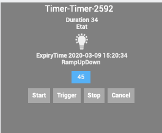
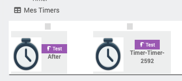
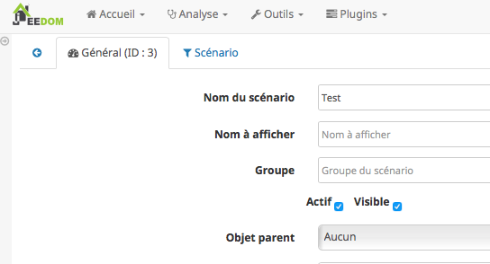
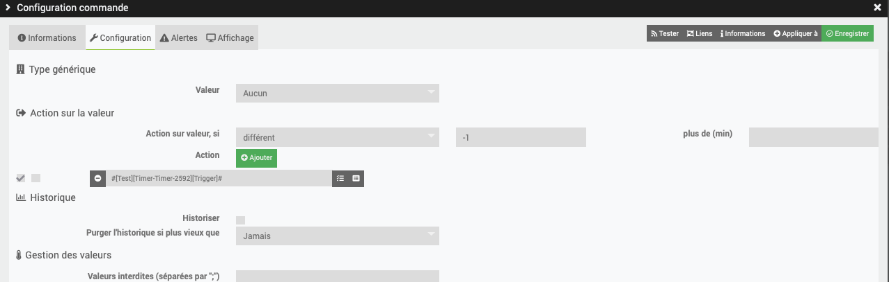
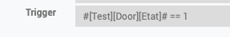

#####
Timer
#####

.. image:: images/node_Timer.png

************
Introduction
************

Ce plugin fonctionne à la seconde.

Fonctionnement
==============

Le timer possède 4 phases:

T0->T1: RampUp de 0 à 100% => RampUp

T1->T2: Stable à 100% => duration (Seconde)

T2->T3: Ramp Down de 100% à 0% => RampDown

T3-> : n existe plus

Exemple d'application: allumage progressif d une ampoule, maintient allumé pendant x secondes puis extinction progressive.

[NOTE]
Il est important de noter que chaque phase fait au minimum 1s.

[NOTE]
Le rafraichissement du widget se fait toutes les 5s mais la mise à jour des valeurs se fait toutes les secondes.

Trois commandes
===============

* Start: permet d'exécuter une commande et de démarrer le Timer.
* Cancel: permet d'exécuter une commande et d'annuler le Timer.
* Stop: permet d'exécuter une commande, à l'expiration du Timer.
* Trigger: a un role particulier. Si vous appeler cette commande, le plugin va parcourir les commandes Start, STop, Cancel pour trouver si une condition associée est vri et dans ce cas executer la commande.

Retour d'information
====================

* Time-Time: Date de la dernière action sur le Timer
* Time-TimeStamp: Heure système de la dernière action
* Duration: Temps restant avant expiration du Timer en secondes
* ExpiryTime: Heure d'expiration du Timer
* RampUpDown: Pourcentage entre 0 et 100 (Ramp Up 0->100, Ramp Down 100->0)
* Etat: 0 ou 1. 1 si timer demarré.

Elles ne sont pas forcement toutes visibles, à vous de choisir.

Dans les phase de ramp Up ou Down, la commande actionRamp/scenarioRamp est exécutée régulièrement avec pour paramètre la valeur en cours de RampUpDown.

Creation d un Timers
====================

Pour créer un objet Timer, clic sur le bouton "Timer" dans la configuration du plugin.

Un message doit apparaitre pour annoncer la création du Timer avec un Id Abeille-NombreAléatoire.

.. image:: images/Capture_d_ecran_2018_03_21_a_13_14_36.png

Apres avoir rafraichi l'écran vous devriez avoir l objet:

Configuration du Timer
======================

Equipement
----------

Comme pour tous les objets, dans l'onglet Équipement, vous pouvez changer son nom, le rattacher à un objet Parent, etc...

Param
-----

Dans l'onglet paramétrage du Timer, remplissez les champs:

* Ramp Up (s)): temps en secondes pour passer de T0 à T1
* Active (s): c'est la durée en secondes entre T1 et T2, soit entre la fin du ramp up et le début du ramp down.
* Ramp Down (s)): temps en secondes pour passer de T2 à T3
* Action sur demarrage: Action a éxecuter au démarrage du Timer
* Action sur arret: arret executée lors de l'expiration du timer.
* Action sur annulation: action excutée si le timer est annulé
* Ramp Action: action qui sera executer lors de la variation de la commande info RampUpDown.
* Parametre: parametres fournis à la commande STart/Stop/Cancel lors de son execution.
* Scenario sur demarrage: Scenario a éxecuter au démarrage du Timer
* Scenario sur arret: Scenario executée lors de l'expiration du timer.
* Scenario sur annulation: Scenario excutée si le timer est annulé
* Trigger: Chaque commande Start/Stop/Cancel peut avoir une condition qui sera vérifiée lors d'un appel à la commande Trigger.

[NOTE]
Toutes les commandes sont au format \#[objet][equipement][cmd]# par exemple \#[test][Ruban][Level]#

[Note]
Dans les parametres actions, vous pouvez mentionner plusieurs actions a executer en les separant par &&. Par exemple #[Cuisine][Ampoule1][On]# &&  #[Cuisine][Ampoule2][On]#

Commande ou Scénario
====================

Par défaut l'objet Timer est créé avec des commande Start, Stop, Cancel qui font référence à l'exécution d'une commande.

Mais vous avez la possibilité d'appeler un scénario à la place d'une commande.

Cela vous permet beaucoup plus de flexibilité comme le lancement d'une série de commandes.

L'Id du scénario est dans le tab de la page de configuration du scenario.

Ici vous pouvez voir l'ID 3 du scénario utilisé.

[NOTE]
Vous pouvez declencher le Timer depuis une (ou plusieures) commandes info d'autres équipements. Pour cela selectionner la commande Trigger du Timer comme ci dessous:

Vous pouver provoquer cette execution uniquement si certains criteres ou tout le temps en mettant un critere toujours valide. Ici par exemple different de -1 qui est toujours vrai pour une valeur binaire.

Ensuite le Timer va regarder qu'elle action executer (Start, Stop, Cancel) en fonction des critères définis dans les parametres:

Ce qui interressant ici est que la formule peut inclure ce que vous voulez et pas forcement la commande qui a provoqué le trigger.

Exemple:

Controler un eclairage sur ouverture d'un porte. Le scenario le plus simple est: j'ouvre la porte l'eclairage s allume, je ferme la port l eclairage s eteint.
Mais comment faire par exemple si je veux sortir 3 minutes en refermant la porte alors qu'il fait nuit ?
Et etre sure que si la porte reste ouverte toute la nuit, l'eclairage lui s'eteigne apres 1 heure d'eclairage ?

Il suffit de chainer les timers !!!

* Sur la commande "etat" du capteur de porte, je met un trigger sur timer 1.
* Je donne au timer 1 une durée d'1h sur ouverture de porte
* Je demande le declenchement du timer 2 sur Stop du Timer 1 (Quand je ferme la porte)
* Le timer 2 start et reste allumé pour 5 minutes ce qui me laisse le temps de faire mes trois minutes avant de rentrer.
