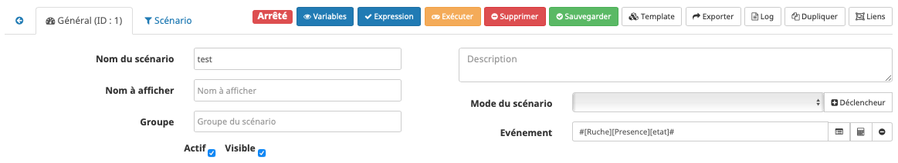
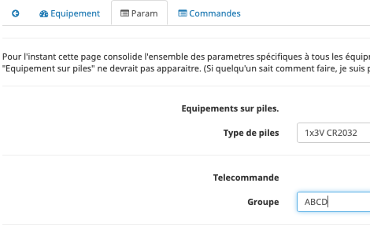
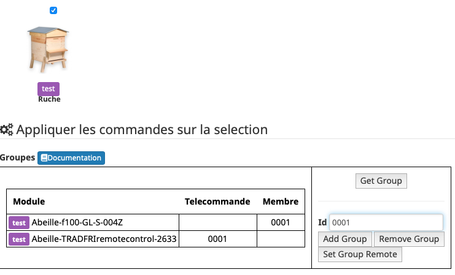
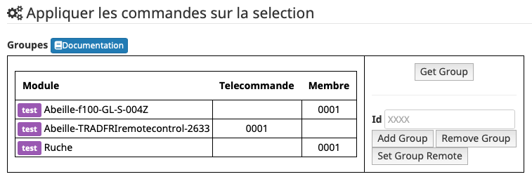
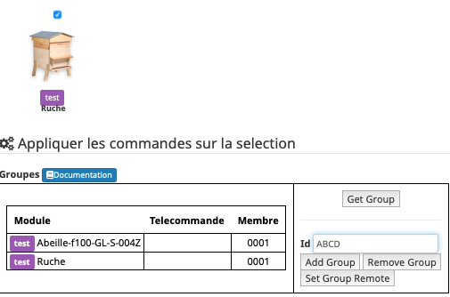
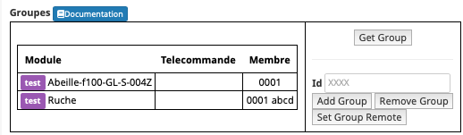
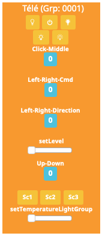

####
Tuto
####

**********
Scénario 1
**********

Pilotage d'une ampoule à partir d'un capteur de présence avec un scénario

Pré-requis
==========

* Ampoule IKEA incluse (Dans cette exemple : le nom de l'objet est "Ampoule")
* Capteur de présence inclus (Dans cette exemple : le nom de l'objet est "Capteur")
* Télécommande IKEA incluse (Dans cette exemple : le nom de l'objet est "Tele")

Réalisation
===========

Nous allons utiliser les scénarios:

.. image:: images/Capture_d_ecran_2018_10_30_a_10_33_20.png

Créons un scénario "test" avec pour déclencheur "Présence".

Et les actions:

.. image:: images/Capture_d_ecran_2018_10_30_a_10_40_48.png

Ici, quand une présence est détectée, on allume l'ampoule et quand la présence n'est pas activée on éteint l'ampoule.

**********
Scénario 2
**********

Pilotage d’une ampoule à partir d’un capteur de présence avec un scénario (=Scenario 1) plus commande de cette même ampoule à l'aide d'une télécommande physique.

Présence->Ampoule<-Télécommande

Continuons en configurant l'ampoule depuis la "Tele":

* Allumer l'ampoule.
* Approcher la télécommande à quelques centimètres de l'ampoule
* Appuyer plus de 10s sur le bouton OO au dos de la télécommande: la led rouge sur la face avant de la télécommande doit clignoter et l'ampoule doit se mettre à à clignoter.

La télécommande pilote l'ampoule et l'ampoule remonte son état à Jeedom.

**********
Scenario 3
**********

Vous avez des télécommandes réelles incluses dans le réseau zigbee. Par exemple une télécommande ronde 5 boutons Ikea. Si vous avez associé des ampoules (ou une seule) avec elle vous pouvez télécommander les ampoules simultanémant directement depuis la télécommande réelle. Mais vous ne pouvez pas le faire depuis Jeedom. Comment faire ? Normalement cette télécommande est aussi dans dans Abeille. Ouvrez les paramètres (deuxième tab) et ajoutez le groupe de votre télécommande réelle. Maintenant vous pouvez commander depuis Abeille/Jeedom.

Ci dessous exemple avec le groupe "ABCD".

**********
Scénario 4
**********

Récupérer les boutons d'une télécommande dans Jeedom.

Fonctionnement
==============

Le principe est qu'une télécommande zigbee (Ikea, Hue,..) envoie des commandes directement à un :doc:`Groups` d'équipements zigbee (Ampoules,...) qui agissent en fonction. Mais dans la configuration de base la ZiGate ne prend pas en compte ces messages. Le firmware ZiGate a donc été modifier pour traiter ces messages. L'idée a été de faire passer la ZiGate pour un équipement classique qui réagit aux messages de groupes. La réaction est d'envoyer un message à Abeille/Jeedom. Cela suppose que la ZiGate possède l'adresse de groupe auquel elle doit réagir.

Pré-requis
==========

Vous avez une télécommande dans votre réseau zigbee et vous connaissez le groupe qu'elle utilise.

Réalisation
===========

Pour connaitre les groupes configurés dans la zigate allez dans la page de configuration du plugin, sélectionnez la zigate et faite un "Get Group".

Si la zigate possede un groupe alors on doit avoir quelque chose comme:

Ici elle indique réagir au groupe "0001" (Colonne "Membre" / C'est une valeur hexadécimale de 4 digits).

Si elle ne possède pas de groupe ajoutez le groupe de votre télécommande. Je vais prendre pour exemple une télécommande Ikea et leur donner le groupe "ABCD".

Pour se faire je sélectionne la ruche, je mets "ABCD" dans l'Id et j'appuie sur le bouton "Add Group".

Puis un "get group":

J'ai bien "ABCD" dans la zigate en plus de "0001".

La zigate est limitée à 5 groupes.

Une fois la ZiGate configurée, vous devriez recevoir les informations sur l'objet Télécommande Ikea and Abeille.

En fonction des boutons sur lesquels vous avez appuyé, les commandes de la télécommande doivent se mettre à jour. Commande Up-Down pour les bouton Haut et Bas, etc...
Vous trouverez la table de correspondance ici :ref:`telecommande-ikea-recuperation`.
